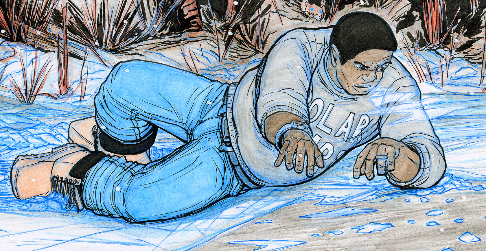

    

        <a href="{{ "" | prepend: site.baseurl }}" class="bd-logo-home">
        <svg height="130" width="344" viewBox="0 0 234 68" id="bd-logo"><title>Bob Dry Illustration logo</title><g><path d="M4.2,2.6C9.1,1.5,14.7,1,21.6,1c8.8,0,17.9,2.4,17.9,8.5c0,5-4.1,8.8-9.6,11.7C36.7,21.7,42,24.9,42,31.3c0,8.5-8.9,15.3-21,15.3c-3.1,0-7.1-0.3-10.3-0.9c-2.3-0.5-3.6-1.5-4.1-5.5c-0.9-8.6-1.2-15.1-1.2-22.4l0-4c-0.7,0.2-1.3,0.3-1.8,0.3c-1.2,0-1.9-0.6-2.2-2C1.1,10.6,1,9.1,1,7.6c0-0.6,0-1.3,0.1-1.9C1.2,3.3,2.3,3,4.2,2.6z M16.7,19.7c5.8-1.8,10-4.8,11.4-7.4c-1.4-0.6-3.5-0.9-6.1-0.9c-1.6,0-3.4,0.1-5.4,0.3C16.6,14.4,16.7,17.1,16.7,19.7z M22.3,27.7c-1.7,0-3.6,0.1-5.2,0.4l0.4,7.6c1.5,0.3,2.9,0.3,4.2,0.3c5.1,0,8.2-1.8,8.2-5.1C30,28.6,26.3,27.7,22.3,27.7z"/><path d="M68,17.1c0,0.3,0,0.6-0.2,1.5c6.5,1.6,10.4,6.7,10.4,13.6c0,9.7-8.6,15-16.6,15c-10.9,0-17.8-5.5-17.8-15.6c0-10.3,9.1-17.1,17.7-17.1c1.4,0,3.2,0.3,4.7,0.7C67.3,15.5,68,15.8,68,17.1z M61.7,23.8c-4.2,0.4-7.4,3.7-7.4,8.1c0,3.7,3.1,5.9,6.7,5.9c3.4,0,7.2-2.1,7.2-5.9c0-2.4-1.6-4-3.9-4.7C62.4,26.6,61.8,26.3,61.7,23.8z"/><path d="M84.3,1.3c1.1-0.1,2.4-0.2,3.6-0.2c0.9,0,1.8,0,2.6,0.1c1.6,0.1,2,0.8,2,2.5c0,2.1-0.4,9-0.4,14.5c2.4-2.5,6.1-3.7,9.6-3.7c7.5,0,13.4,5.1,13.4,15.8c0,9.4-7.7,16.6-15.5,16.6c-3,0-5.4-0.9-7.2-2.3c-0.2,0.9-0.9,1.3-2.4,1.5c-1.3,0.2-3.5,0.3-4.9,0.3c-2.6,0-2.8-0.8-3-2.8C81.3,35.4,81,28.1,81,20.5c0-4.9,0.1-10,0.4-15.5C81.5,2.5,82.1,1.5,84.3,1.3z M92.3,36.6c1.1,0.6,2.2,0.9,3.7,0.9c4.1,0,8.1-3.2,8.1-7.1c0-4-2.4-5.7-5.6-5.7c-2.2,0-4.6,0.8-6.5,2.6C92.1,30.3,92.2,33.5,92.3,36.6z"/><path d="M135.1,42.1c-1.3-10.4-1.7-18.6-1.7-28.2c-0.2,0.1-0.4,0.1-0.5,0.1c-0.6,0.2-1.2,0.3-1.7,0.3c-1.2,0-2.1-0.6-2.4-2.3c-0.2-1.3-0.4-2.6-0.4-4c0-0.6,0-1.2,0.1-1.8c0.2-2.2,0.9-2.7,3-3.2c6.5-1.3,12.5-1.9,19.7-1.9c12.7,0,22.2,4.9,22.2,18.1c0,15.4-15.5,27.2-32,27.2c-0.9,0-1.8-0.1-2.7-0.1C136.3,46.1,135.5,45.2,135.1,42.1z M144.7,11.9c0.2,8.5,0.6,15.4,1.2,23.1c6.4-1.1,16.4-6.4,16.4-16.1c0-5.5-5.2-7.3-12.2-7.3C148.4,11.6,146.6,11.7,144.7,11.9z"/><path d="M179.1,15.2c1.9-0.5,5.7-0.8,7.7-0.8c1.2,0,1.6,0.6,1.6,1.6c0,0.5-0.1,1.3-0.1,1.9c2.3-2.1,5.2-3.5,8.6-3.5c2.2,0,3.4,2.3,3.9,4.4c0.4,2,0.4,4.5,0.4,6.2c0,1.6-0.7,3-3.1,4.4c-1.1,0.6-3.1,1.4-4.1,1.4c-1.4,0-2.2-1.5-2.2-2.9c0-0.9-0.1-2.7-0.3-3.8c-1.2,0.6-2,1.1-3.4,2.2c0,9.1,0.9,16.3,0.9,17.6c0,1.5-0.6,2.2-3.3,2.3c-0.6,0.1-1.3,0.1-2.1,0.1c-0.7,0-1.4,0-2-0.1c-2.6-0.1-3.1-1.1-3.3-3.2c-0.7-6.4-1.1-13.1-1.1-19.6c0-1.5,0-3,0.1-4.5C177.4,17,177.4,15.6,179.1,15.2z"/><path d="M222.5,61.4c-5.9,0-10.5-1-15.3-3.2c-1.1-0.5-1.9-1.3-1.9-2.4c0-0.9,1.1-3.8,2-5.4c0.6-0.9,0.9-1.4,1.7-1.4c0.4,0,0.9,0.2,1.6,0.4c4.2,1.4,6.9,1.8,11,1.8c0.5-2.9,0.8-5.8,0.9-8.8c-3.1,2.3-6.7,3.3-10.5,3.3c-3.4,0-9.7-0.9-9.7-8.7c0-4.4,0.4-12,1.4-19.2c0.3-2.3,1.6-2.8,4.3-2.8c1.4,0,2.9,0.2,4.1,0.6c1.4,0.4,2,1.3,2,2.7c0,1.6-1,8.6-1,14.9c0,2,0.8,3.2,2.4,3.2c2.1,0,4.6-0.8,7.1-2.4c-0.1-6.3-1.1-14.5-1.1-15.5c0-1.6,0.7-2.5,3.2-3.2c1-0.3,2.6-0.5,3.7-0.5c2.2,0,3.4,0.4,3.7,2.7c0.5,4.5,0.9,12.6,0.9,20.8c0,5.7-0.2,11.4-0.7,16C231.8,58.1,228,61.4,222.5,61.4z"/></g><g><path d="M8.4,66.1L9.1,66c0.2,0,0.3-0.1,0.3-0.1c0.1-0.1,0.1-0.2,0.1-0.4l0-6.6c0-0.2,0-0.3-0.1-0.4c-0.1-0.1-0.2-0.1-0.3-0.1l-0.7-0.1v-0.7l3.5,0v0.7l-0.7,0.1c-0.2,0-0.3,0.1-0.3,0.1c-0.1,0.1-0.1,0.2-0.1,0.4l0,6.6c0,0.2,0,0.3,0.1,0.4c0.1,0.1,0.2,0.1,0.3,0.1l0.7,0.1l0,0.7l-3.5,0V66.1z"/><path d="M28.2,66.9h-6.8v-0.7l0.7-0.1c0.2,0,0.3-0.1,0.3-0.1c0.1-0.1,0.1-0.2,0.1-0.4l0-6.6c0-0.2,0-0.3-0.1-0.4c-0.1-0.1-0.2-0.1-0.3-0.1l-0.7-0.1v-0.7l3.5,0v0.7l-0.8,0.1c-0.2,0-0.3,0.1-0.3,0.1c-0.1,0.1-0.1,0.2-0.1,0.4l0,7.1l2.9,0c0.2,0,0.3,0,0.4-0.1c0.1-0.1,0.1-0.2,0.1-0.3l0.1-1h0.9L28.2,66.9z"/><path d="M44,66.9h-6.8v-0.7l0.7-0.1c0.2,0,0.3-0.1,0.3-0.1c0.1-0.1,0.1-0.2,0.1-0.4l0-6.6c0-0.2,0-0.3-0.1-0.4c-0.1-0.1-0.2-0.1-0.3-0.1l-0.7-0.1v-0.7h3.5v0.7l-0.8,0.1c-0.2,0-0.3,0.1-0.3,0.1c-0.1,0.1-0.1,0.2-0.1,0.4l0,7.1h2.9c0.2,0,0.3,0,0.4-0.1c0.1-0.1,0.1-0.2,0.1-0.3l0.1-1h0.9L44,66.9z"/><path d="M54.6,66.2c-0.6-0.5-0.9-1.3-0.9-2.4l0-4.9c0-0.2,0-0.3-0.1-0.4c-0.1-0.1-0.2-0.1-0.3-0.1l-0.7-0.1v-0.7l3.5,0v0.7l-0.7,0.1c-0.2,0-0.3,0.1-0.3,0.1c-0.1,0.1-0.1,0.2-0.1,0.4v4.7c0,0.8,0.2,1.4,0.7,1.8c0.4,0.4,1.1,0.6,2,0.6c0.5,0,1-0.1,1.3-0.2c0.3-0.1,0.6-0.4,0.7-0.8c0.2-0.4,0.2-0.9,0.2-1.5l0-4.6c0-0.2,0-0.3-0.1-0.4c-0.1-0.1-0.2-0.1-0.3-0.1l-0.7-0.1v-0.7H62v0.7l-0.7,0.1c-0.2,0-0.3,0.1-0.3,0.1c-0.1,0.1-0.1,0.2-0.1,0.4v4.8c0,1-0.3,1.8-1,2.4c-0.7,0.6-1.6,0.9-2.7,0.9C56.1,67,55.2,66.7,54.6,66.2z"/><path d="M70.9,66.4l0.2-2.1l1,0l0.2,1.5c0.6,0.2,1.2,0.3,2,0.3c0.4,0,0.7-0.1,1-0.2c0.3-0.1,0.6-0.3,0.8-0.6c0.2-0.3,0.3-0.6,0.3-0.9c0-0.3,0-0.5-0.1-0.6c-0.1-0.2-0.2-0.3-0.5-0.5c-0.2-0.2-0.6-0.3-1-0.5l-1.6-0.6c-0.7-0.2-1.2-0.5-1.5-0.9c-0.4-0.4-0.5-0.8-0.5-1.4c0-0.5,0.1-0.9,0.4-1.3c0.3-0.4,0.6-0.7,1.1-0.9c0.5-0.2,1-0.3,1.7-0.3c0.6,0,1.1,0,1.5,0.1c0.4,0.1,0.9,0.2,1.3,0.3l-0.2,2h-1l-0.2-1.2c-0.5-0.2-1-0.3-1.7-0.3c-0.5,0-1,0.1-1.3,0.3c-0.3,0.2-0.5,0.6-0.5,1c0,0.4,0.1,0.8,0.4,1c0.2,0.3,0.7,0.5,1.3,0.7l1.2,0.4c0.5,0.2,0.9,0.4,1.3,0.5c0.3,0.2,0.6,0.4,0.8,0.7c0.2,0.3,0.3,0.7,0.3,1.2c0,0.5-0.2,1-0.5,1.4c-0.3,0.4-0.8,0.7-1.3,1c-0.6,0.2-1.2,0.4-1.8,0.4C72.8,67,71.8,66.8,70.9,66.4z"/><path d="M94.7,57.6l-0.1,2.2h-0.9l-0.1-1c0-0.1-0.1-0.2-0.1-0.3c-0.1-0.1-0.2-0.1-0.4-0.1h-2v7.1c0,0.2,0,0.3,0.1,0.4c0.1,0.1,0.2,0.1,0.3,0.1l0.8,0.1v0.7h-3.6v-0.7l0.8-0.1c0.2,0,0.3-0.1,0.3-0.1c0.1-0.1,0.1-0.2,0.1-0.4v-7.1h-2.1c-0.2,0-0.3,0-0.4,0.1c-0.1,0.1-0.1,0.2-0.1,0.3l-0.1,1h-0.9l-0.1-2.2L94.7,57.6z"/><path d="M112.1,66l-0.1,0.8c-0.2,0.2-0.6,0.2-1,0.2c-0.3,0-0.6-0.1-0.9-0.2c-0.3-0.2-0.5-0.4-0.8-0.7l-1.8-2.5c-0.2-0.3-0.4-0.5-0.6-0.6c-0.2-0.1-0.4-0.2-0.6-0.2h-0.5v2.8c0,0.2,0,0.3,0.1,0.4c0.1,0.1,0.2,0.1,0.3,0.1l0.9,0.1v0.7h-3.6v-0.7l0.7-0.1c0.2,0,0.3-0.1,0.3-0.1c0.1-0.1,0.1-0.2,0.1-0.4v-6.6c0-0.2,0-0.3-0.1-0.4c-0.1-0.1-0.2-0.1-0.3-0.1l-0.7-0.1v-0.7l3.7,0c1.1,0,1.9,0.2,2.4,0.6c0.5,0.4,0.8,1,0.8,1.7c0,0.7-0.2,1.3-0.7,1.8c-0.5,0.4-1.1,0.7-1.9,0.8c0.2,0.1,0.4,0.2,0.5,0.3c0.1,0.1,0.3,0.3,0.4,0.5l1.5,2.2c0.3,0.4,0.7,0.7,1.2,0.7C111.8,66.1,112,66.1,112.1,66z M108.8,61.4c0.3-0.3,0.5-0.7,0.5-1.3c0-0.5-0.2-0.9-0.6-1.2c-0.4-0.3-0.9-0.4-1.6-0.4h-1.2l0,3.3h1.3C107.9,61.8,108.4,61.6,108.8,61.4z"/><path d="M129.7,66.1v0.7h-3.5v-0.7l0.7-0.1c0.2,0,0.4-0.1,0.4-0.3c0-0.1,0-0.2-0.1-0.3l-0.6-1.7h-3.8l-0.6,1.6c0,0.1-0.1,0.2-0.1,0.3c0,0.2,0.1,0.3,0.4,0.3l0.7,0.1v0.7h-3.3l0-0.7l0.5-0.1c0.2,0,0.3-0.1,0.4-0.2c0.1-0.1,0.2-0.2,0.3-0.4l3.1-7.9l1.3,0l3,7.9c0.1,0.2,0.2,0.3,0.3,0.4c0.1,0.1,0.2,0.1,0.4,0.2L129.7,66.1z M126.3,62.9l-1.4-3.7l-0.2-0.6l-0.2,0.6l-1.4,3.7H126.3z"/><path d="M145.6,57.6l-0.1,2.2h-0.9l-0.1-1c0-0.1-0.1-0.2-0.1-0.3c-0.1-0.1-0.2-0.1-0.4-0.1h-2l0,7.1c0,0.2,0,0.3,0.1,0.4c0.1,0.1,0.2,0.1,0.3,0.1l0.8,0.1v0.7h-3.6v-0.7l0.8-0.1c0.2,0,0.3-0.1,0.3-0.1c0.1-0.1,0.1-0.2,0.1-0.4v-7.1l-2.1,0c-0.2,0-0.3,0-0.4,0.1c-0.1,0.1-0.1,0.2-0.1,0.3l-0.1,1h-0.9l-0.1-2.2L145.6,57.6z"/><path d="M154.5,66.1l0.7-0.1c0.2,0,0.3-0.1,0.3-0.1c0.1-0.1,0.1-0.2,0.1-0.4v-6.6c0-0.2,0-0.3-0.1-0.4c-0.1-0.1-0.2-0.1-0.3-0.1l-0.7-0.1v-0.7l3.5,0v0.7l-0.7,0.1c-0.2,0-0.3,0.1-0.3,0.1c-0.1,0.1-0.1,0.2-0.1,0.4v6.6c0,0.2,0,0.3,0.1,0.4c0.1,0.1,0.2,0.1,0.3,0.1l0.7,0.1v0.7l-3.5,0V66.1z"/><path d="M168.4,65.8c-0.7-0.8-1.1-1.9-1.1-3.4c0-1.5,0.4-2.7,1.2-3.6c0.8-0.9,1.9-1.4,3.5-1.4c1.4,0,2.5,0.4,3.2,1.2c0.7,0.8,1.1,1.9,1.1,3.4c0,1.5-0.4,2.7-1.2,3.6c-0.8,0.9-1.9,1.4-3.5,1.4C170.2,67,169.1,66.6,168.4,65.8z M174.3,65.2c0.5-0.6,0.7-1.5,0.7-2.7c0-2.7-1.1-4.1-3.3-4.1c-1.1,0-1.8,0.3-2.3,0.9c-0.4,0.6-0.7,1.5-0.7,2.7c0,2.7,1.1,4.1,3.3,4.1C173,66.1,173.8,65.8,174.3,65.2z"/><path d="M195.4,57.6v0.7l-0.7,0.1c-0.2,0-0.3,0.1-0.3,0.1c-0.1,0.1-0.1,0.2-0.1,0.4l0,8h-1l-5.2-7.1l-0.4-0.6l0.1,0.7v5.7c0,0.2,0,0.3,0.1,0.4c0.1,0.1,0.2,0.1,0.3,0.1l0.7,0.1v0.7h-3.3l0-0.7l0.7-0.1c0.2,0,0.3-0.1,0.3-0.1c0.1-0.1,0.1-0.2,0.1-0.4v-6.6c0-0.2,0-0.3-0.1-0.4c-0.1-0.1-0.2-0.1-0.3-0.1l-0.7-0.1v-0.7l2.2,0l5.1,7l0.5,0.8l-0.2-0.8v-5.7c0-0.2,0-0.3-0.1-0.4c-0.1-0.1-0.2-0.1-0.3-0.1l-0.7-0.1v-0.7H195.4z"/></g></svg>
        </a>
        <a href="izaak/izaak-1.html" class="port">
        <svg height="100%" width="100%" viewBox="0 0 288 80" id="izaak"><title>The Izaak Walton League</title><path d="M220.7,68.2c-1.6-0.4-2.7-0.9-3.3-1.4c-0.6-0.5-1.2-1.7-1.8-3.6L194.2,0.4h-15.8l-21.6,62.8c-0.6,1.9-1.3,3.1-1.9,3.7c-0.6,0.5-1.7,1-3.1,1.4l-0.2,0.1l-0.2-0.1c-1.6-0.4-2.7-0.9-3.3-1.4c-0.6-0.5-1.2-1.7-1.8-3.6L124.8,0.4h-15.8L87.4,63.2c-0.6,1.9-1.3,3.1-1.9,3.7c-0.6,0.5-1.7,1-3.1,1.4L82,68.4l-0.4-12.1H70.8L70,63.8c-0.1,1.2-0.4,2.1-1,2.5c-0.6,0.4-1.6,0.7-3,0.7H42.8L80.6,12V0.4L25.8,0l0.7,23.3h10.7l0.9-7.7c0.1-1.2,0.4-2.1,1.1-2.5c0.6-0.4,1.6-0.7,3-0.7h19.4L23.9,67v11.9L82.3,79l0-0.1h24.8v-9.8l-3.6-0.9c-2.1-0.4-3.1-1.3-3.1-2.5c0-0.5,0.2-1.3,0.6-2.5l2.3-7.5h24l2.4,7.8c0.4,1.2,0.5,2.1,0.5,2.5c0,0.6-0.2,1-0.7,1.4c-0.5,0.3-1.2,0.6-2.2,0.8l-3.8,0.9v9.8h25.9h3.9h23v-9.8l-3.6-0.9c-2.1-0.4-3.1-1.3-3.1-2.5c0-0.5,0.2-1.3,0.6-2.5l2.3-7.5h24l2.4,7.8c0.4,1.2,0.5,2.1,0.5,2.5c0,0.6-0.2,1-0.7,1.4c-0.5,0.3-1.2,0.6-2.2,0.8l-3.8,0.9v9.8h29.8v-10L220.7,68.2z M107,44.1l7.6-24.4l0.7-3.1l0.6,3.1l7.7,24.4H107z M176.4,44.1l7.6-24.4l0.7-3.1l0.6,3.1l7.7,24.4H176.4z"/><path d="M0,78.9h21.9v-9.7L18,67.9c-1.3-0.4-2.1-0.8-2.5-1.4c-0.4-0.5-0.6-1.5-0.6-2.8V15.6c0-1.3,0.2-2.2,0.6-2.8c0.4-0.5,1.2-1,2.5-1.4l3.9-1.3V0.4H0V78.9z"/><path d="M288,67c-1-0.2-2-0.6-2.8-1.3c-1.3-1-3-2.8-5-5.5l-17.8-24.7l17.8-21c1.1-1.3,2.3-2.1,3.6-2.5c1-0.3,2.4-0.4,4.2-0.5v-11h-4.8c-5.3,0-9.2,1.6-11.8,4.8l-24.5,29.5V15.5c0-1.5,0.2-2.4,0.6-2.9c0.4-0.5,1.2-0.9,2.5-1.2l5.2-1.2V0.4h-30.6v9.7l3.8,1.3c1.3,0.4,2.1,0.9,2.5,1.4c0.4,0.5,0.6,1.4,0.6,2.7v48.2c0,1.3-0.2,2.2-0.6,2.7c-0.4,0.5-1.2,1-2.5,1.4l-3.8,1.3v9.7h30.6v-9.7L250,68c-1.3-0.3-2.1-0.7-2.5-1.2c-0.4-0.5-0.6-1.5-0.6-2.9V38.8l19.8,29.1c2.9,4.4,5.7,7.5,8.4,9.3c2.7,1.9,5.7,2.8,9.1,2.8c1.4,0,2.6-0.1,3.9-0.3V67z"/></svg>
        
        </a>
    

    

        <a href="hero/hero-1.html" class="port">
        <svg  xmlns="http://www.w3.org/2000/svg" xmlns:xlink="http://www.w3.org/1999/xlink" height="100%" width="100%" viewBox="0 0 288 97" id="hero"><title>Quarantine Heroes</title><path d="M35.6,32.6c-2.2-2-3.3-5-3.3-8.9V7.2c0-0.6-0.1-1-0.2-1.2c-0.2-0.2-0.5-0.4-1.1-0.6l-1.7-0.6V0.5h13.5v4.3l-2.1,0.6c-0.6,0.2-1,0.3-1.1,0.6c-0.2,0.2-0.2,0.6-0.2,1.3v16c0,2.3,0.7,4.1,2,5.2c1.3,1.2,3,1.7,5.1,1.7c1.4,0,2.5-0.2,3.3-0.7c0.8-0.4,1.4-1.2,1.7-2.2c0.4-1,0.5-2.4,0.5-4.3V7.2c0-0.6-0.1-1.1-0.2-1.3c-0.2-0.2-0.5-0.4-1.1-0.6l-2.1-0.6V0.5h13.1v4.3l-1.7,0.6c-0.6,0.2-1,0.4-1.1,0.6c-0.2,0.2-0.2,0.6-0.2,1.2v16.6c0,2.5-0.6,4.6-1.8,6.4c-1.2,1.8-2.8,3.1-4.8,4c-2,0.9-4.3,1.4-6.7,1.4C41,35.6,37.8,34.6,35.6,32.6z"/><path d="M224.8,5.9c0.2-0.2,0.5-0.4,1.1-0.6l1.8-0.6V0.5h-12.9h-0.3h-28.3h-1.1h-11.6v4.3l2.5,0.4c0.6,0.1,0.9,0.3,1.1,0.6c0.2,0.2,0.2,0.7,0.2,1.4V22l0.7,2.8l-1.4-2.6L162.1,0.5h-9.4v4.3l1.7,0.4c0.6,0.1,0.9,0.3,1.1,0.6c0.2,0.3,0.3,0.7,0.3,1.3v21.3c0,0.6-0.1,1-0.2,1.2c-0.2,0.2-0.5,0.4-1.1,0.6l-1.6,0.5v-0.1l-1-0.3c-0.7-0.2-1.2-0.4-1.5-0.6c-0.3-0.2-0.5-0.8-0.8-1.6L140,0.5h-7.1l-9.7,27.7c-0.3,0.8-0.6,1.4-0.8,1.6c0,0,0,0,0,0c-0.3,0.1-0.6,0.1-1,0.1c-0.9,0-1.6-0.2-2.1-0.6c-0.5-0.4-1.1-1-1.7-1.9l-3-4.6c-0.7-1.1-1.4-1.9-2-2.6c-0.6-0.6-1.3-1-2-1.3c2.5-0.4,4.6-1.4,6.2-3.1c1.6-1.7,2.4-3.9,2.4-6.4c0-3-1-5.3-2.9-6.8c-2-1.5-4.9-2.2-8.9-2.2H93.5v4.3l1.7,0.6c0.6,0.2,1,0.4,1.1,0.6c0.2,0.2,0.2,0.6,0.2,1.2v21.2c0,0.6-0.1,1-0.2,1.2c-0.2,0.2-0.5,0.4-1.1,0.6l-1.6,0.5v-0.1l-1-0.3c-0.7-0.2-1.2-0.4-1.5-0.6c-0.3-0.2-0.5-0.8-0.8-1.6L80.8,0.5h-7.1l-9.7,27.7c-0.3,0.8-0.6,1.4-0.8,1.6c-0.3,0.2-0.7,0.4-1.4,0.6l-1,0.3v4.4h12.1v-4.3l-1.6-0.4c-0.9-0.2-1.4-0.6-1.4-1.1c0-0.2,0.1-0.6,0.3-1.1l1.1-3.3H82l1.1,3.5c0.2,0.5,0.2,0.9,0.2,1.1c0,0.3-0.1,0.5-0.3,0.6c-0.2,0.1-0.5,0.3-1,0.4l-1.7,0.4v4.3h13.2h0.1h13.8v-4.3l-2.6-0.5c-0.6-0.1-1-0.3-1.1-0.5c-0.2-0.2-0.3-0.7-0.3-1.3v-7.7c0.8,0,1.5,0.2,2,0.5c0.5,0.3,1,0.9,1.5,1.7l4.7,7.8c0.9,1.5,1.9,2.7,3.2,3.5c1.2,0.8,2.6,1.2,4,1.2c0.8,0,1.6-0.2,2.5-0.5h10.8v-4.3l-1.6-0.4c-0.9-0.2-1.4-0.6-1.4-1.1c0-0.2,0.1-0.6,0.3-1.1l1.1-3.3h10.7l1.1,3.5c0.2,0.5,0.2,0.9,0.2,1.1c0,0.3-0.1,0.5-0.3,0.6c-0.2,0.1-0.5,0.3-1,0.4l-1.7,0.4v4.3h13.2h0.1h12.6v-4.3l-2.5-0.6c-0.6-0.2-0.9-0.3-1.1-0.6c-0.2-0.2-0.3-0.6-0.3-1.3V13.7l-0.5-2.4l1.4,2.1l14.4,21.6h6.3v-28c0-0.6,0.1-1.1,0.3-1.3c0.2-0.2,0.6-0.4,1.1-0.6l0.8-0.2l0.2,5.4h4.4l0.3-3.3c0-0.5,0.2-0.9,0.4-1.1c0.3-0.2,0.7-0.3,1.3-0.3h4.4v22.7c0,0.6-0.1,1.1-0.3,1.3c-0.2,0.2-0.5,0.4-1.1,0.5l-2.6,0.4v4.4h14.9v-4.4l-2.6-0.4c-0.6-0.1-0.9-0.3-1.1-0.5c-0.2-0.2-0.3-0.7-0.3-1.3V5.7h4.4c0.6,0,1.1,0.1,1.4,0.3c0.3,0.2,0.4,0.6,0.5,1.1l0.3,3.3h4.4l0.2-5.6l1.6,0.5c0.6,0.2,0.9,0.4,1.1,0.6c0.2,0.2,0.3,0.6,0.3,1.2v21.2c0,0.6-0.1,1-0.3,1.2c-0.2,0.2-0.5,0.4-1.1,0.6l-1.8,0.6v4.3h13.2v-4.3l-1.8-0.6c-0.6-0.2-0.9-0.4-1.1-0.6c-0.2-0.2-0.3-0.6-0.3-1.2V7.2C224.5,6.6,224.6,6.2,224.8,5.9zM72.9,19.8L76.2,9l0.3-1.3L76.9,9l3.4,10.8H72.9z M107,15.7h-3.4V5.7h3.4c1.7,0,3,0.4,3.7,1.3c0.8,0.8,1.2,2.1,1.2,3.7c0,1.7-0.4,2.9-1.2,3.7C109.8,15.3,108.6,15.7,107,15.7z M132,19.8L135.4,9l0.3-1.3L136,9l3.4,10.8H132z"/><path d="M262.9,0.5v4.3l-1.7,0.4c-0.6,0.2-1,0.4-1.1,0.6c-0.2,0.2-0.3,0.7-0.3,1.3v28h-6.3l-14.4-21.6l-1.4-2.1l0.5,2.4v14.7c0,0.6,0.1,1.1,0.3,1.3c0.2,0.2,0.6,0.4,1.1,0.6l2.5,0.6v4.3h-12.7v-4.3l1.7-0.6c0.6-0.2,1-0.4,1.1-0.6c0.2-0.2,0.2-0.6,0.2-1.2V7.1c0-0.6-0.1-1.1-0.3-1.3c-0.2-0.3-0.5-0.4-1.1-0.6l-1.7-0.4V0.5h9.4l14.6,21.7l1.4,2.6l-0.7-2.8V7.1c0-0.7-0.1-1.1-0.2-1.4c-0.2-0.2-0.5-0.4-1.1-0.6l-2.5-0.4V0.5H262.9z"/><path d="M100.7,96.2H58.1V89l2.9-0.7c1-0.2,1.6-0.5,1.9-0.9c0.3-0.4,0.4-1.1,0.4-2.1V49c0-1.1-0.1-1.9-0.4-2.3c-0.3-0.4-0.9-0.7-1.9-0.9l-2.9-0.5v-7.2h42.3l-0.6,16.6h-7.5l-0.6-5.5c-0.1-0.9-0.4-1.5-0.8-1.9c-0.5-0.3-1.2-0.5-2.2-0.5H74.9v14.9h16.6v9H74.9v16.6h13.7c1.1,0,1.8-0.2,2.3-0.5c0.5-0.3,0.7-0.9,0.8-1.9l0.6-6h7.8L100.7,96.2z"/><path d="M153.4,86.8l-1,8.3c-2.4,1.2-4.5,1.9-6.6,1.9c-2.4,0-4.6-0.7-6.7-2.1c-2.1-1.4-3.8-3.4-5.3-5.9L126,75.8c-0.8-1.3-1.6-2.3-2.5-2.9c-0.9-0.6-2-0.8-3.4-0.8V85c0,1.1,0.2,1.8,0.5,2.2c0.3,0.4,1,0.7,1.9,0.8l4.3,0.9v7.2h-23.5V89l2.9-1c1-0.3,1.7-0.7,1.9-1c0.3-0.3,0.4-1,0.4-2.1V49.3c0-1-0.1-1.7-0.4-2.1c-0.3-0.3-0.9-0.7-1.9-1l-2.9-1v-7.2h23.2c6.6,0,11.6,1.2,14.9,3.7c3.3,2.5,4.9,6.3,4.9,11.4c0,4.3-1.3,7.8-4,10.7c-2.6,2.9-6.1,4.7-10.4,5.2c1.2,0.4,2.3,1.1,3.3,2.1c1,1,2.2,2.5,3.4,4.3l5,7.7c1,1.6,2,2.7,2.9,3.3c0.9,0.6,2.1,0.9,3.5,0.9C151.5,87.5,152.6,87.3,153.4,86.8z M132.1,61.6c1.3-1.3,2-3.4,2-6.3c0-2.7-0.7-4.8-2-6.3c-1.3-1.4-3.4-2.1-6.3-2.1h-5.7v16.7h5.8C128.7,63.6,130.7,62.9,132.1,61.6z"/><path d="M156.6,89.5c-4.3-5-6.4-11.8-6.4-20.5c0-6.6,1.2-12.2,3.6-17c2.4-4.8,5.8-8.4,10.1-10.9c4.4-2.5,9.6-3.8,15.6-3.8c8.4,0,14.7,2.5,19,7.5c4.3,5,6.4,11.8,6.4,20.5c-0.1,6.4-1.3,11.9-3.7,16.7c-2.4,4.8-5.8,8.5-10.1,11.1c-4.4,2.6-9.5,4-15.5,4C167.2,97,160.8,94.5,156.6,89.5z M189,83.3c2.2-2.9,3.4-7.7,3.4-14.5c0-7.6-1.4-13.2-4.3-16.8c-2.9-3.6-6.8-5.4-11.8-5.4c-4.5,0-7.9,1.4-10.1,4.3c-2.3,2.9-3.4,7.7-3.4,14.5c0,7.6,1.5,13.2,4.4,16.8c2.9,3.6,6.9,5.4,11.8,5.4C183.3,87.6,186.7,86.2,189,83.3z"/><path d="M249,96.2h-42.6V89l2.9-0.7c1-0.2,1.6-0.5,1.9-0.9c0.3-0.4,0.4-1.1,0.4-2.1V49c0-1.1-0.1-1.9-0.4-2.3c-0.3-0.4-0.9-0.7-1.9-0.9l-2.9-0.5v-7.2h42.3l-0.6,16.6h-7.5l-0.6-5.5c-0.1-0.9-0.4-1.5-0.8-1.9c-0.5-0.3-1.2-0.5-2.2-0.5h-13.8v14.9h16.6v9h-16.6v16.6H237c1.1,0,1.8-0.2,2.3-0.5c0.5-0.3,0.7-0.9,0.8-1.9l0.6-6h7.8L249,96.2z"/><path d="M25.1,32.5c-0.3-0.3-0.7-0.8-1.2-1.5c1.2-1.2,2.2-2.6,3.1-4.2c1.4-2.8,2.1-6,2.1-9.6c0-5.6-1.3-9.8-3.8-12.8C22.8,1.5,19,0,13.9,0c-3.5,0-6.6,0.8-9.2,2.3C2.8,3.3,1.3,4.7,0,6.4v24.5c0.1,0.1,0.1,0.2,0.2,0.3c2.5,3,6.3,4.4,11.4,4.4c3.2,0,6-0.6,8.4-1.9c0.4,0.5,0.7,0.9,1,1.3c0.5,0.6,1.2,1.2,1.9,1.8c0.7,0.5,1.6,0.9,2.5,1.1c0.9,0.2,1.8,0.2,2.7,0l1-3.1c-1.1-0.1-2.1-0.5-3-1.1C25.9,33.3,25.4,32.9,25.1,32.5z M20.7,25c-0.2,0.6-0.4,1.1-0.7,1.6c-0.3-0.2-0.6-0.5-0.9-0.7c-0.7-0.5-1.4-0.9-2.2-1.2c-0.8-0.3-1.4-0.5-2-0.6c-0.6-0.1-1-0.2-1.2-0.3l-0.9,3.5c0.2,0.1,0.6,0.2,1.2,0.5c0.6,0.2,1.3,0.6,1.9,1.1c0.3,0.2,0.5,0.4,0.8,0.6c-0.9,0.3-1.9,0.5-3.1,0.5c-3.1,0-5.5-1-7.2-3.1c-1.7-2.1-2.5-5.1-2.5-9.1c0-3,0.3-5.4,0.8-7.1c0.5-1.8,1.4-3.1,2.5-3.8C8.4,6,9.9,5.6,11.8,5.6c3.1,0,5.5,1,7.2,3.1c1.7,2.1,2.5,5.1,2.5,9.1C21.5,20.8,21.2,23.2,20.7,25z"/><path d="M29.8,45.2l3.7,1c1.1,0.3,1.8,0.6,2.1,0.9c0.3,0.4,0.4,1.1,0.4,2.1v12H11.8v-12c0-1.1,0.1-1.8,0.4-2.1c0.3-0.3,1-0.7,2.1-0.9l3.7-1v-7.2H0v58.1h18.1V89l-3.7-1c-1.1-0.3-1.8-0.6-2.1-0.9C12,86.8,11.8,86,11.8,85V70.4h24.3V85c0,1.1-0.1,1.8-0.4,2.1c-0.3,0.4-1,0.7-2.1,0.9l-3.7,1v7.2h24.9V89l-3.2-1c-1.1-0.3-1.8-0.7-2.1-1c-0.3-0.4-0.5-1-0.5-2V49.3c0-1,0.2-1.6,0.5-2c0.3-0.4,1-0.7,2.1-1l3.2-1v-7.2H29.8V45.2z"/><path d="M288,24.9h-3.8l-0.4,3.6c0,0.5-0.2,0.9-0.5,1.1c-0.3,0.2-0.7,0.3-1.4,0.3h-8.2v-9.9h9.9v-5.3h-9.9V5.7h8.2c0.6,0,1,0.1,1.3,0.3c0.3,0.2,0.4,0.6,0.5,1.1l0.3,3.3h3.8V0.5h-24.2v4.3l1.7,0.3c0.6,0.1,0.9,0.3,1.1,0.5c0.2,0.3,0.3,0.7,0.3,1.4v21.6c0,0.6-0.1,1-0.3,1.3c-0.2,0.2-0.5,0.4-1.1,0.6l-1.7,0.4v4.3H288V24.9z"/><path d="M288,69.5c-1.9-1.9-4.7-3.6-8.3-5.2l-8.3-3.6c-2.7-1.2-4.7-2.4-5.8-3.6c-1.2-1.2-1.7-2.7-1.7-4.7c0-2.1,0.7-3.7,2.1-4.9c1.4-1.2,3.5-1.7,6.4-1.7c1.2,0,2.4,0.1,3.7,0.4c1.3,0.2,2.3,0.6,3.1,0.9l1.2,6.1h7.7V39.4c-2.4-0.5-4.6-1-6.7-1.3c-2.6-0.5-5.5-0.7-8.7-0.7c-4.1,0-7.8,0.8-10.9,2.3c-3.2,1.5-5.6,3.6-7.3,6.2c-1.7,2.6-2.6,5.5-2.6,8.6c0,3.8,1.1,7,3.2,9.5c2.2,2.5,5.4,4.7,9.7,6.6l9,3.9c2.4,1.1,4.1,2.1,5,3c0.9,0.9,1.4,2.3,1.4,4c0,2.2-0.8,3.8-2.3,5c-1.6,1.2-3.4,1.8-5.5,1.8c-2.3,0-4.3-0.2-6.1-0.7c-1.8-0.5-3.2-1-4.3-1.6l-1-6.9h-9.1l-1,14.1c1.6,0.8,4.1,1.6,7.4,2.4c3.3,0.9,7.2,1.3,11.4,1.3c4.4,0,8.3-0.8,11.6-2.3c2.7-1.2,5-2.9,6.7-5V69.5z"/></svg>
        
        </a>
    

    

        <a href="nature/nature-1.html" class="port">
        <svg height="100%" width="100%" viewBox="0 0 288 104" id="nature"><title>Nature's Delight</title> <path d="M85.9,42.6v6.1H67.1v-6l2.4-0.5c0.6-0.1,1.1-0.3,1.4-0.5c0.3-0.2,0.4-0.5,0.4-0.8c0-0.3-0.1-0.8-0.3-1.5l-1.5-4.8H54.3l-1.5,4.6c-0.3,0.7-0.4,1.2-0.4,1.5c0,0.8,0.6,1.3,1.9,1.5l2.3,0.5v6h-17v-6.1l1.4-0.4c0.9-0.2,1.6-0.5,2-0.8c0.4-0.3,0.8-1.1,1.2-2.2L57.9,0.6h9.9l13.5,38.5c0.4,1.2,0.8,1.9,1.1,2.2c0.4,0.3,1.1,0.6,2.1,0.9L85.9,42.6z M67.1,27.4l-4.8-15l-0.4-1.9l-0.5,1.9l-4.8,15H67.1z"/> <path d="M148.1,0.6v5.9l3,0.8c0.8,0.2,1.4,0.5,1.6,0.8c0.2,0.3,0.3,0.9,0.3,1.8v22c0,2.5-0.2,4.5-0.7,5.9c-0.5,1.4-1.3,2.4-2.4,3c-1.1,0.6-2.7,0.9-4.7,0.9c-2.9,0-5.3-0.8-7.2-2.4c-1.9-1.6-2.8-4-2.8-7.3V9.9c0-0.9,0.1-1.5,0.3-1.8c0.2-0.3,0.8-0.5,1.6-0.8l3-0.8V0.6h-17.6h-1.3H80.9l0.5,13.8h6.2l0.5-4.6c0-0.8,0.2-1.3,0.6-1.5c0.4-0.3,1-0.4,1.9-0.4h6.2v31.5c0,0.9-0.1,1.5-0.4,1.8c-0.2,0.3-0.8,0.6-1.6,0.7l-3.7,0.6v6.1h20.9v-6.1l-3.7-0.6c-0.8-0.1-1.3-0.4-1.6-0.7c-0.2-0.3-0.4-0.9-0.4-1.8V7.9h6.2c0.9,0,1.5,0.1,1.9,0.4c0.4,0.3,0.6,0.8,0.6,1.5l0.5,4.6h6.2l0.3-7.5l1.3,0.4c0.8,0.3,1.4,0.5,1.6,0.8c0.2,0.3,0.3,0.9,0.3,1.7v22.9c0,5.5,1.6,9.6,4.7,12.4c3.1,2.8,7.5,4.2,13.2,4.2c3.4,0,6.6-0.6,9.5-1.9c2.9-1.3,5.1-3.1,6.8-5.6c1.7-2.4,2.5-5.4,2.5-8.9V9.9c0-0.8,0.1-1.4,0.3-1.7c0.2-0.3,0.8-0.6,1.6-0.8l2.4-0.8V0.6H148.1z"/> <path d="M244.1,48.7l-0.5-14.2h-6.5l-0.5,4.9c0,0.8-0.3,1.3-0.6,1.5c-0.4,0.3-1,0.4-1.9,0.4h-11.5V27.7h13.9v-7.4h-13.9V7.9h11.5c0.8,0,1.5,0.1,1.8,0.4c0.4,0.3,0.6,0.8,0.7,1.5l0.5,4.5h6.2l0.5-13.8h-35.3v5.9l2.4,0.4c0.8,0.1,1.3,0.4,1.6,0.7 c0.2,0.4,0.4,1,0.4,1.9v30c0,0.8-0.1,1.4-0.4,1.8c-0.2,0.3-0.8,0.6-1.6,0.8l-1.2,0.3l0.2-1.5c-0.7,0.4-1.6,0.5-2.8,0.5 c-1.2,0-2.2-0.3-3-0.8c-0.8-0.5-1.6-1.4-2.4-2.7l-4.2-6.3c-1-1.5-2-2.7-2.9-3.6c-0.9-0.9-1.8-1.5-2.8-1.8c3.6-0.5,6.5-1.9,8.7-4.3 c2.2-2.4,3.3-5.4,3.3-8.9c0-4.2-1.4-7.4-4.1-9.4c-2.8-2-6.9-3.1-12.4-3.1H168v5.9l2.4,0.8c0.8,0.3,1.4,0.5,1.6,0.8 c0.2,0.3,0.3,0.9,0.3,1.7v29.5c0,0.8-0.1,1.4-0.3,1.7c-0.2,0.3-0.8,0.6-1.6,0.8l-2.4,0.8v5.9h19.7v-5.9l-3.6-0.7 c-0.8-0.1-1.3-0.4-1.6-0.7c-0.3-0.3-0.4-0.9-0.4-1.8V28.8c1.1,0,2.1,0.2,2.8,0.7c0.8,0.5,1.5,1.3,2.1,2.4l6.6,10.9 c1.3,2.1,2.7,3.7,4.5,4.9c1.7,1.2,3.6,1.7,5.6,1.7c1.5,0,3.2-0.4,4.9-1.3v0.6H244.1z M186.9,21.7H182V7.9h4.8c2.4,0,4.2,0.6,5.3,1.8 c1.1,1.2,1.6,2.9,1.6,5.2c0,2.4-0.6,4.1-1.7,5.2C190.9,21.2,189.2,21.7,186.9,21.7z"/> <path d="M253.9,0.7c1,0.4,1.8,1.1,2.5,2.1c0.7,0.9,1.1,2,1.1,3.3c0,2.1-1,4.6-3.1,7.4c-2,2.8-4.2,5-6.5,6.7l-2.1-2.3 c2.2-2.2,3.8-4.7,5-7.4c-1.3-0.6-2.4-1.3-3.3-2.1c-0.9-0.8-1.3-1.7-1.3-2.6c0-0.8,0.3-1.7,0.8-2.6c0.5-0.9,1.2-1.7,1.9-2.3 c0.8-0.6,1.6-0.9,2.3-0.9C252.1,0.1,253,0.3,253.9,0.7z"/> <path d="M79.9,103.3H41.1v-6.5l2.6-0.7c0.9-0.2,1.4-0.5,1.7-0.8c0.3-0.4,0.4-1,0.4-1.9V60.7c0-1-0.1-1.7-0.4-2.1 c-0.3-0.4-0.8-0.7-1.7-0.8l-2.6-0.4v-6.5h38.5l-0.5,15h-6.8l-0.5-4.9c-0.1-0.8-0.4-1.4-0.8-1.7c-0.4-0.3-1.1-0.4-2-0.4H56.5v13.5 h15.1v8.1H56.5v15h12.5c1,0,1.7-0.1,2.1-0.4c0.4-0.3,0.6-0.8,0.7-1.7l0.6-5.4h7.1L79.9,103.3z"/> <path d="M119.8,103.3H83.2v-6.5l2.6-0.9c0.9-0.3,1.4-0.6,1.7-0.9c0.3-0.3,0.4-0.9,0.4-1.8V61c0-0.9-0.1-1.5-0.4-1.8 c-0.3-0.3-0.8-0.7-1.7-0.9l-2.6-0.9v-6.5h21.5v6.5l-4,0.9c-0.9,0.2-1.4,0.5-1.7,0.8c-0.3,0.3-0.4,1-0.4,1.9v34.1h10.1 c1,0,1.7-0.1,2.1-0.4c0.4-0.3,0.6-0.8,0.7-1.7l0.6-5.6h7.2L119.8,103.3z"/> <path d="M122.4,96.8l2.7-0.9c0.9-0.2,1.4-0.5,1.7-0.9c0.3-0.4,0.4-1,0.4-1.9V61c0-0.9-0.1-1.5-0.4-1.9 c-0.3-0.4-0.8-0.7-1.7-0.9l-2.7-0.9v-6.5h20.2v6.5l-2.7,0.9c-0.9,0.2-1.4,0.5-1.7,0.9c-0.3,0.4-0.4,1-0.4,1.9v32.1 c0,0.9,0.1,1.5,0.4,1.9c0.3,0.4,0.8,0.7,1.7,0.9l2.7,0.9v6.5h-20.2V96.8z"/> <path d="M190.5,78.5l-0.1,6.5l-1.8,0.5c-0.7,0.2-1.2,0.5-1.5,0.8c-0.3,0.3-0.4,1-0.4,2v11c-2.8,1.3-5.7,2.4-8.8,3.3 c-3.1,0.9-6.6,1.3-10.4,1.3c-8.1,0-14.1-2.2-18-6.5c-3.9-4.3-5.9-10.5-5.9-18.4c0-5.9,1.1-11,3.2-15.3c2.1-4.4,5.1-7.7,9.1-10.1 c3.9-2.4,8.6-3.5,13.9-3.5c6,0,11.9,1.5,17.5,4.5L186.1,68h-7.4l-1.2-7.1c-2.9-1.5-6.3-2.3-10.1-2.3c-3,0-5.3,0.5-7.1,1.6 c-1.8,1.1-3.1,2.9-3.9,5.3c-0.9,2.4-1.3,5.8-1.3,10c0,6.7,1.1,11.7,3.4,15c2.3,3.2,6.2,4.9,11.7,4.9c2.4,0,4.5-0.3,6.4-0.9v-5.9 c0-0.9-0.1-1.6-0.4-1.9c-0.3-0.4-0.8-0.6-1.7-0.8l-4.1-0.7v-6.5H190.5z"/> <path d="M237.9,59.2c-0.3,0.3-0.4,0.9-0.4,1.8v32.1c0,0.9,0.1,1.5,0.4,1.8c0.3,0.3,0.8,0.7,1.7,0.9l2.6,0.9v6.5h-20.4 v-6.5l3-0.9c0.9-0.2,1.5-0.5,1.8-0.8c0.2-0.3,0.4-1,0.4-1.9V80.1h-19.9v13.1c0,1,0.1,1.6,0.4,1.9c0.2,0.3,0.8,0.6,1.8,0.8l3,0.9v6.5 h-20.4v-6.5l2.6-0.9c0.9-0.3,1.4-0.6,1.7-0.9c0.3-0.3,0.4-0.9,0.4-1.8V61c0-0.9-0.1-1.5-0.4-1.8c-0.3-0.3-0.8-0.7-1.7-0.9l-2.6-0.9 v-6.5h20.4v6.5l-3,0.9c-0.9,0.2-1.5,0.5-1.8,0.8c-0.2,0.3-0.4,1-0.4,1.9v10.8H227V61c0-1-0.1-1.6-0.4-1.9c-0.2-0.3-0.8-0.6-1.8-0.8 l-3-0.9v-6.5h20.4v6.5l-2.6,0.9C238.7,58.5,238.2,58.9,237.9,59.2z"/> <path d="M23.5,6.5L27,7.2c0.8,0.2,1.3,0.4,1.5,0.8c0.2,0.3,0.3,1,0.3,1.9v20.7l1,3.9l-2-3.7L7.4,0.6H0v48.1h12.1v-5.9 L8.7,42c-0.8-0.2-1.3-0.5-1.6-0.8c-0.2-0.3-0.4-0.9-0.4-1.8V19L6,15.8l1.9,2.9l20.3,30H37V9.8c0-0.9,0.1-1.5,0.4-1.8 c0.3-0.3,0.8-0.6,1.6-0.8l2.3-0.6V0.6H23.5V6.5z"/> <path d="M17.3,50.9H0v52.4h17.3c5,0,9.3-1.2,12.9-3.6c3.6-2.4,6.4-5.8,8.4-10c1.9-4.2,2.9-9,2.9-14.3 c0-8.1-1.9-14.2-5.8-18.3C31.7,53,25.6,50.9,17.3,50.9z M28.6,87.8c-0.9,2.6-2.4,4.5-4.3,5.6c-1.9,1.1-4.5,1.7-7.6,1.7H9.9V59.1h6.8 c4.6,0,7.9,1.4,10.1,4.3c2.2,2.9,3.2,7.5,3.2,13.8C30,81.6,29.6,85.2,28.6,87.8z"/> <path d="M288,25.9c-1.5-1.3-3.6-2.5-6.1-3.6l-7-3c-2.3-1-3.9-2-4.9-3c-1-1-1.4-2.3-1.4-3.9c0-1.7,0.6-3.1,1.8-4 c1.2-1,3-1.4,5.3-1.4c1,0,2,0.1,3.1,0.3c1.1,0.2,1.9,0.5,2.6,0.8l1,5.1h5.6V1.5c-1.7-0.4-3.3-0.7-4.7-0.9C281.1,0.2,278.7,0,276,0 c-3.4,0-6.5,0.6-9.1,1.9c-2.6,1.3-4.7,3-6.1,5.1c-1.5,2.1-2.2,4.5-2.2,7.2c0,3.2,0.9,5.8,2.7,7.9c1.8,2.1,4.5,3.9,8.1,5.4l7.5,3.2 c2,0.9,3.4,1.7,4.2,2.5c0.8,0.8,1.1,1.9,1.1,3.3c0,1.8-0.6,3.2-1.9,4.2c-1.3,1-2.8,1.5-4.6,1.5c-1.9,0-3.6-0.2-5.1-0.6 c-1.5-0.4-2.7-0.8-3.6-1.3l-0.8-5.7h-7.6l-0.8,11.7c1.3,0.6,3.4,1.3,6.2,2c2.8,0.7,6,1.1,9.6,1.1c3.7,0,6.9-0.6,9.7-1.9 c1.9-0.8,3.5-1.9,4.8-3.2V25.9z"/> <path d="M288,50.9h-42.9l0.6,15.1h6.8l0.5-5c0-0.8,0.3-1.4,0.7-1.7c0.4-0.3,1.1-0.4,2-0.4h6.8v34.3c0,1-0.1,1.6-0.4,2 c-0.3,0.4-0.8,0.6-1.7,0.8l-4,0.7v6.7h22.8v-6.7l-4-0.7c-0.9-0.1-1.4-0.4-1.7-0.8c-0.3-0.4-0.4-1-0.4-2V58.8h6.7 c1,0,1.7,0.1,2.1,0.4c0.4,0.3,0.6,0.8,0.7,1.7l0.5,5h5V50.9z"/></svg>
        
        </a>
    

    

        <a href="ice/" class="port">
        <svg height="100%" width="100%" viewBox="0 0 616 250" id="hatch"><title>Ice in the Shadows</title><path class="st0" d="M39.3,198.5l-13.2-5.7c-4.3-1.9-7.4-3.9-9.2-5.7c-1.8-1.9-2.7-4.3-2.7-7.4c0-3.3,1.1-5.9,3.4-7.7c2.2-1.8,5.6-2.7,10.1-2.7c1.9,0,3.8,0.2,5.8,0.6c2,0.4,3.6,0.9,4.9,1.5l1.9,9.7h13.8l1.8-21c-5.2-1.2-9.8-2.1-13.9-2.9c-4.1-0.7-8.7-1.1-13.8-1.1c-6.5,0-12.3,1.2-17.3,3.6c-4.6,2.2-8.2,5.1-10.9,8.7v29.2c0.1,0.1,0.2,0.2,0.3,0.4c3.4,3.9,8.6,7.4,15.4,10.4l14.2,6.1c3.8,1.7,6.4,3.3,7.9,4.8c1.4,1.5,2.2,3.6,2.2,6.3c0,3.4-1.2,6-3.7,7.9c-2.5,1.9-5.3,2.9-8.6,2.9c-3.6,0-6.9-0.4-9.7-1.1c-2.8-0.7-5.1-1.5-6.8-2.5l-1.5-10.8H0v24.6c1.6,0.5,3.4,1,5.4,1.5c5.3,1.4,11.3,2,18.1,2c6.9,0,13.1-1.2,18.4-3.6c5.3-2.4,9.4-5.7,12.4-10c3-4.3,4.4-9.3,4.4-15c0-5-1.5-9.3-4.5-12.9C51.1,204.9,46.2,201.6,39.3,198.5z"/><path class="st0" d="M148.1,171.7c-0.5,0.6-0.7,1.7-0.7,3.2v56.2c0,1.5,0.2,2.6,0.7,3.2c0.5,0.6,1.5,1.1,3,1.7l4.6,1.5v11.3h-35.4v-11.3l5.2-1.5c1.6-0.4,2.6-0.9,3-1.5c0.4-0.6,0.6-1.7,0.6-3.4v-22.9H94.6v22.9c0,1.7,0.2,2.8,0.6,3.4c0.4,0.6,1.4,1,3,1.5l5.2,1.5v11.3H67.9v-11.3l4.6-1.5c1.5-0.5,2.5-1.1,3-1.7c0.5-0.6,0.7-1.7,0.7-3.2v-56.2c0-1.5-0.2-2.6-0.7-3.2c-0.5-0.6-1.5-1.1-3-1.7l-4.6-1.5v-11.3h35.6v11.3l-5.2,1.5c-1.6,0.4-2.6,0.9-3,1.5c-0.4,0.6-0.6,1.7-0.6,3.4v18.9h34.5v-18.9c0-1.7-0.2-2.8-0.6-3.4c-0.4-0.6-1.4-1-3-1.5l-5.2-1.5v-11.3h35.4v11.3l-4.6,1.5C149.6,170.5,148.6,171.1,148.1,171.7z"/><path class="st0" d="M247.6,237v11.7h-35.6v-11.4l4.6-1c1.2-0.3,2.1-0.6,2.6-1c0.5-0.4,0.8-0.9,0.8-1.6c0-0.5-0.2-1.5-0.6-2.9l-2.9-9.2h-28.6l-2.8,8.8c-0.5,1.4-0.8,2.3-0.8,2.9c0,1.4,1.2,2.4,3.7,2.9l4.3,1v11.4h-32.1V237l2.7-0.8c1.8-0.4,3-1,3.7-1.6c0.7-0.6,1.5-2.1,2.2-4.3l25.8-73.2h18.8l25.5,73.2c0.8,2.2,1.5,3.6,2.2,4.2c0.7,0.6,2,1.1,3.9,1.7L247.6,237z M212.1,208.2l-9.1-28.5l-0.8-3.6l-0.9,3.6l-9,28.5H212.1z"/><path class="st0" d="M323.5,167.9c6.7,7.2,10.1,17.8,10.1,32c0,9.2-1.7,17.6-5,25c-3.3,7.4-8.2,13.2-14.5,17.5c-6.3,4.2-13.8,6.4-22.5,6.4h-39.5v-11.3l4.6-1.5c1.5-0.5,2.5-1.1,3-1.7c0.5-0.6,0.7-1.7,0.7-3.4v-56.1c0-1.7-0.2-2.9-0.7-3.6c-0.5-0.7-1.5-1.2-3-1.5l-4.6-1.1v-11.3h39.5C306.1,157.2,316.8,160.8,323.5,167.9z M303.7,231.5c3.4-2,5.9-5.3,7.6-9.9c1.7-4.6,2.5-10.8,2.5-18.6c0-11-1.9-19.1-5.7-24.1c-3.8-5-9.6-7.6-17.6-7.6h-11.8v63.1h11.8C296,234.5,300.4,233.5,303.7,231.5z"/><path class="st0" d="M349.1,238.2c-6.7-7.8-10.1-18.6-10.1-32.4c0-10.3,1.9-19.3,5.7-26.8c3.8-7.5,9.1-13.2,16.1-17.2c6.9-4,15.2-6,24.6-6c13.3,0,23.3,3.9,30,11.8c6.7,7.8,10.1,18.6,10.1,32.4c-0.1,10-2,18.8-5.8,26.3c-3.8,7.5-9.1,13.3-16.1,17.5c-6.9,4.2-15.1,6.2-24.5,6.2C365.9,250,355.9,246.1,349.1,238.2z M400.4,228.4c3.6-4.5,5.3-12.1,5.3-22.8c0-12-2.3-20.8-6.9-26.4c-4.6-5.7-10.8-8.5-18.7-8.5c-7.1,0-12.5,2.2-16.1,6.7c-3.6,4.5-5.4,12.1-5.4,22.9c0,12,2.3,20.8,6.9,26.4c4.6,5.7,10.9,8.5,18.7,8.5C391.5,235.3,396.8,233,400.4,228.4z"/><path class="st0" d="M557.9,157.2v11.3l-3.4,0.9c-1.9,0.5-3.1,1-3.8,1.6c-0.7,0.6-1.3,1.8-1.9,3.9l-19.9,73.9h-19.6l-15.6-49.2l-1.4-4.2l-0.5,4.2l-15.6,49.2h-19.7l-20.6-73.9c-0.4-1.6-1-2.7-1.8-3.2c-0.8-0.6-1.7-1-2.8-1.4c-1.1-0.4-1.9-0.7-2.5-0.8l-2-0.9v-11.3h37.8v11.2l-8.1,1.3c-1.7,0.4-2.5,1.2-2.5,2.4c0,0.4,0.1,1.1,0.4,1.9c0.3,0.8,0.5,1.7,0.6,2.4l12.4,45.8l1.8,6.9l0.4-6.9l16.3-53.8h16.1l16.9,53.8l1.5,6.5l0.4-6.5l12.3-45.8c0.2-0.5,0.4-1.2,0.6-2.2c0.2-0.9,0.3-1.7,0.3-2.2c0-1.2-0.8-2-2.5-2.4l-8-1.3v-11.2H557.9z"/><path class="st0" d="M617,205.2c-2.9-2.4-6.7-4.6-11.4-6.7l-13.2-5.7c-4.3-1.9-7.4-3.9-9.2-5.7c-1.8-1.9-2.7-4.3-2.7-7.4c0-3.3,1.1-5.9,3.4-7.7c2.2-1.8,5.6-2.7,10.1-2.7c1.9,0,3.8,0.2,5.8,0.6c2,0.4,3.6,0.9,4.9,1.5l1.9,9.7H617v-22.1c-3.1-0.7-6.1-1.3-8.8-1.7c-4.1-0.7-8.7-1.1-13.8-1.1c-6.5,0-12.3,1.2-17.3,3.6c-5,2.4-8.9,5.7-11.6,9.7c-2.8,4.1-4.1,8.6-4.1,13.6c0,6,1.7,11,5.1,14.9c3.4,3.9,8.6,7.4,15.4,10.4l14.2,6.1c3.8,1.7,6.4,3.3,7.9,4.8c1.4,1.5,2.2,3.6,2.2,6.3c0,3.4-1.2,6-3.7,7.9c-2.5,1.9-5.3,2.9-8.6,2.9c-3.6,0-6.9-0.4-9.7-1.1c-2.8-0.7-5.1-1.5-6.8-2.5l-1.5-10.8h-14.5l-1.5,22.3c2.5,1.2,6.5,2.5,11.7,3.8c5.3,1.4,11.3,2,18.1,2c6.9,0,13.1-1.2,18.4-3.6c3.5-1.6,6.4-3.5,8.9-5.9V205.2z"/><path class="st0" d="M339.8,137.2l3.3-1.1c1.1-0.3,1.8-0.7,2.1-1.1c0.3-0.5,0.5-1.2,0.5-2.3V92.9c0-1.1-0.2-1.8-0.5-2.3c-0.3-0.5-1-0.8-2.1-1.1l-3.3-1.1v-8h24.9v8l-3.3,1.1c-1.1,0.3-1.8,0.7-2.1,1.1c-0.3,0.5-0.5,1.2-0.5,2.3v39.8c0,1.1,0.2,1.8,0.5,2.3c0.3,0.5,1,0.8,2.1,1.1l3.3,1.1v8h-24.9V137.2z"/><path class="st0" d="M431.9,80.4v8l-3.1,0.8c-1.1,0.3-1.8,0.7-2.2,1.1c-0.4,0.5-0.5,1.3-0.5,2.5v52.4h-11.8l-27.2-40.5l-2.6-4l1,4.4v27.5c0,1.2,0.2,2,0.5,2.4c0.3,0.4,1,0.7,2.1,1l4.7,1.1v8h-23.9v-8l3.2-1.1c1.1-0.4,1.9-0.7,2.2-1.1c0.3-0.4,0.5-1.2,0.5-2.3V92.8c0-1.2-0.2-2-0.5-2.5c-0.3-0.5-1-0.8-2.1-1.1l-3.2-0.8v-8h17.6l27.5,40.6l2.7,5l-1.3-5.2V92.8c0-1.3-0.2-2.1-0.5-2.6c-0.3-0.4-1-0.8-2.1-1l-4.7-0.8v-8H431.9z"/><path class="st0" d="M503,80.4L502.3,99H494l-0.6-6.2c-0.1-1-0.3-1.7-0.9-2.1c-0.5-0.4-1.4-0.5-2.6-0.5h-8.3v42.5c0,1.2,0.2,2,0.5,2.5c0.3,0.5,1,0.8,2.1,0.9l5,0.8v8.3h-28.1V137l5-0.8c1.1-0.2,1.8-0.5,2.1-0.9c0.3-0.5,0.5-1.3,0.5-2.5V90.2h-8.4c-1.2,0-2,0.2-2.5,0.5c-0.5,0.4-0.8,1.1-0.8,2.1l-0.6,6.2H448l-0.7-18.7H503z"/><path class="st0" d="M561.1,90.7c-0.3,0.4-0.5,1.2-0.5,2.3v39.8c0,1.1,0.2,1.8,0.5,2.3c0.3,0.4,1,0.8,2.1,1.2l3.2,1.1v8h-25.1v-8l3.7-1.1c1.1-0.3,1.9-0.6,2.2-1c0.3-0.4,0.4-1.2,0.4-2.4v-16.2h-24.5v16.2c0,1.2,0.1,2,0.5,2.4c0.3,0.4,1,0.7,2.2,1l3.7,1.1v8h-25.2v-8l3.2-1.1c1.1-0.4,1.8-0.8,2.1-1.2c0.3-0.4,0.5-1.2,0.5-2.3V92.9c0-1.1-0.2-1.8-0.5-2.3c-0.3-0.4-1-0.8-2.1-1.2l-3.2-1.1v-8h25.2v8l-3.7,1.1c-1.1,0.3-1.9,0.6-2.2,1c-0.3,0.4-0.5,1.2-0.5,2.4v13.4h24.5V92.9c0-1.2-0.2-2-0.4-2.4c-0.3-0.4-1-0.7-2.2-1l-3.7-1.1v-8h25.1v8l-3.2,1.1C562.1,89.8,561.4,90.2,561.1,90.7z"/><path class="st0" d="M618,126.2h-7.5l-0.7,6.7c-0.1,1-0.3,1.7-0.9,2.1c-0.5,0.4-1.4,0.5-2.6,0.5H591v-18.6h18.6v-10H591V90.2h15.5c1.1,0,2,0.2,2.5,0.5c0.5,0.4,0.8,1.1,0.9,2.1l0.6,6.1h7.5V80.4h-45.9v8l3.2,0.5c1.1,0.2,1.8,0.5,2.1,1c0.3,0.5,0.5,1.4,0.5,2.6V133c0,1.1-0.2,1.9-0.5,2.4c-0.3,0.5-1,0.8-2.1,1l-3.2,0.8v8H618V126.2z"/><path class="st0" d="M0,20.5l6,1.7c2.7,0.7,4.4,1.5,5.3,2.5c0.8,1,1.2,2.7,1.2,5.1v88.5c0,2.4-0.4,4.1-1.2,5.1c-0.8,1-2.6,1.8-5.3,2.5l-6,1.7v18.5h59.7v-17.8l-8.3-2.4c-2.7-0.7-4.4-1.5-5.3-2.5c-0.8-1-1.2-2.7-1.2-5.1V29.8c0-2.4,0.4-4.1,1.2-5.1c0.8-1,2.6-1.8,5.3-2.5l8.3-2.4V2H0V20.5z"/><path class="st0" d="M86.4,130c-12.1-12.1-18.1-29-18.1-50.7c0-15.9,3.2-29.8,9.7-41.8c6.5-11.9,15.8-21.2,27.8-27.7c12-6.5,26-9.8,42-9.8c17.5,0,34,3.9,49.7,11.8l-3.6,38.8h-22.6l-5.2-22c-2.7-1.2-6.5-2.4-11.3-3.6c-4.9-1.2-10-1.8-15.6-1.8c-13.3,0-22.6,3.7-27.9,11.1c-5.3,7.4-8,18.6-8,33.5c0,37.5,14.9,56.3,44.8,56.3c11.6,0,21.6-1.5,29.8-4.4c8.2-2.9,12.5-4.5,13-4.6l6.7,19.8c-20.3,8.8-40.1,13.2-59.4,13.2C115.8,148.2,98.5,142.1,86.4,130z"/><path class="st0" d="M324.9,146.2H206v-17.8l8.1-1.8c2.7-0.5,4.4-1.3,5.3-2.3c0.8-1,1.2-2.8,1.2-5.3V29c0-2.8-0.4-4.7-1.2-5.8c-0.8-1.1-2.6-1.8-5.3-2.2l-8.1-1.2V2h118l-1.6,41.3h-20.8l-1.6-13.6c-0.3-2.3-1.1-3.8-2.4-4.6c-1.3-0.8-3.3-1.2-6.2-1.2H253v37h46.4v22.2H253v41.3h38.3c3,0,5.1-0.4,6.4-1.2c1.3-0.8,2-2.3,2.1-4.6l1.8-14.8h21.7L324.9,146.2z"/></svg>
        
        </a>
    

    

        <a href="con/con-1.html" class="port con-commish">
        <svg height="100%" width="100%" viewBox="0 0 288 68" id="con"><title>Convention Commissions</title> <path d="M29.7,30.7c-2.5-2.9-3.8-7-3.8-12.1c0-3.9,0.7-7.2,2.1-10c1.4-2.8,3.4-4.9,6-6.4C36.7,0.7,39.7,0,43.3,0 c5,0,8.7,1.5,11.2,4.4c2.5,2.9,3.8,7,3.8,12.1c0,3.7-0.8,7-2.2,9.8c-1.4,2.8-3.4,5-6,6.5c-2.6,1.6-5.6,2.3-9.2,2.3 C36,35.1,32.2,33.7,29.7,30.7z M48.9,27.1c1.3-1.7,2-4.5,2-8.5c0-4.5-0.9-7.8-2.6-9.9s-4-3.2-7-3.2c-2.7,0-4.7,0.8-6,2.5 c-1.3,1.7-2,4.5-2,8.5c0,4.5,0.9,7.8,2.6,9.9c1.7,2.1,4.1,3.2,7,3.2C45.5,29.6,47.5,28.8,48.9,27.1z"/> <path d="M126.2,29.4c-0.2,0.2-0.5,0.4-1.1,0.5l-1.7,0.4v4.2h25.2l-0.3-10.1h-4.6l-0.4,3.5c0,0.5-0.2,0.9-0.5,1.1 c-0.3,0.2-0.7,0.3-1.4,0.3h-8.1v-9.8h9.8v-5.3h-9.8V5.6h8.2c0.6,0,1,0.1,1.3,0.3c0.3,0.2,0.4,0.6,0.5,1.1l0.3,3.2h4.4l0.3-9.8H124 h-0.7h-12.1v4.2l2.8,0.5c0.3,0,0.5,0.1,0.6,0.3c0.1,0.2,0.2,0.4,0.2,0.5c0,0.1-0.1,0.5-0.2,1l-5.6,17.4l-0.3,2.6l-0.6-2.6l-6.1-17.3 c-0.2-0.5-0.2-0.9-0.2-1c0-0.2,0.1-0.4,0.2-0.5c0.1-0.2,0.3-0.3,0.5-0.3l3-0.5V0.5H92.4h-0.9H79.9v4.2l2.5,0.4 c0.6,0.1,0.9,0.3,1.1,0.5c0.2,0.2,0.2,0.7,0.2,1.4v14.7l0.7,2.8l-1.4-2.6L68.5,0.5h-9.3v4.2l1.7,0.4c0.6,0.1,0.9,0.3,1.1,0.6 c0.2,0.3,0.3,0.7,0.3,1.3v21c0,0.6-0.1,1-0.2,1.2c-0.2,0.2-0.5,0.4-1.1,0.6l-1.7,0.6v4.2h12.6v-4.2l-2.5-0.6 c-0.6-0.2-0.9-0.3-1.1-0.5c-0.2-0.2-0.3-0.6-0.3-1.3V13.6l-0.5-2.3l1.4,2.1l14.3,21.3h6.2V7c0-0.6,0.1-1.1,0.3-1.3 c0.2-0.2,0.6-0.4,1.1-0.6l1.2-0.3L92.6,5c0.7,0.2,1.1,0.4,1.3,0.6c0.2,0.2,0.4,0.6,0.7,1.3l10,27.8h7l9.3-27.6 c0.2-0.6,0.4-1,0.6-1.2c0.2-0.3,0.5-0.4,0.9-0.6c0.4-0.1,0.7-0.2,0.8-0.2l0.7-0.3l1.3,0.2c0.6,0.1,0.9,0.3,1.1,0.5 c0.2,0.3,0.3,0.7,0.3,1.4v21.3C126.5,28.8,126.4,29.2,126.2,29.4z"/> <path d="M221.6,5.9c0.2-0.2,0.5-0.4,1.1-0.6l1.8-0.6V0.5h-12.8h-0.3h-28h-1.1h-11.5v4.2l2.5,0.4 c0.6,0.1,0.9,0.3,1.1,0.5c0.2,0.2,0.2,0.7,0.2,1.4v14.7l0.7,2.8l-1.4-2.6L159.4,0.5h-9.3v4.2l1.7,0.4c0.6,0.1,0.9,0.3,1.1,0.6 c0.2,0.3,0.3,0.7,0.3,1.3v21c0,0.6-0.1,1-0.2,1.2c-0.2,0.2-0.5,0.4-1.1,0.6l-1.7,0.6v4.2h12.6v-4.2l-2.5-0.6 c-0.6-0.2-0.9-0.3-1.1-0.5c-0.2-0.2-0.3-0.6-0.3-1.3V13.6l-0.5-2.3l1.4,2.1l14.3,21.3h6.2V7c0-0.6,0.1-1.1,0.3-1.3 c0.2-0.2,0.6-0.4,1.1-0.6l0.7-0.2l0.2,5.4h4.4l0.3-3.3c0-0.5,0.2-0.9,0.4-1.1c0.3-0.2,0.7-0.3,1.3-0.3h4.4V28c0,0.6-0.1,1.1-0.3,1.3 s-0.5,0.4-1.1,0.5l-2.6,0.4v4.4h14.8v-4.4l-2.6-0.4c-0.6-0.1-0.9-0.3-1.1-0.5s-0.3-0.7-0.3-1.3V5.6h4.4c0.6,0,1.1,0.1,1.4,0.3 c0.3,0.2,0.4,0.6,0.5,1.1l0.3,3.3h4.4l0.2-5.5l1.6,0.5c0.6,0.2,0.9,0.4,1.1,0.6c0.2,0.2,0.3,0.6,0.3,1.2v21c0,0.6-0.1,1-0.3,1.2 c-0.2,0.2-0.5,0.4-1.1,0.6l-1.8,0.6v4.2h13.1v-4.2l-1.8-0.6c-0.6-0.2-0.9-0.4-1.1-0.6c-0.2-0.2-0.3-0.6-0.3-1.2v-21 C221.4,6.5,221.5,6.1,221.6,5.9z"/> <path d="M229.2,30.7c-2.5-2.9-3.8-7-3.8-12.1c0-3.9,0.7-7.2,2.1-10c1.4-2.8,3.4-4.9,6-6.4c2.6-1.5,5.7-2.2,9.2-2.2 c5,0,8.7,1.5,11.2,4.4c2.5,2.9,3.8,7,3.8,12.1c0,3.7-0.8,7-2.2,9.8c-1.4,2.8-3.4,5-6,6.5c-2.6,1.6-5.6,2.3-9.2,2.3 C235.4,35.1,231.7,33.7,229.2,30.7z M248.3,27.1c1.3-1.7,2-4.5,2-8.5c0-4.5-0.9-7.8-2.6-9.9c-1.7-2.1-4-3.2-7-3.2 c-2.7,0-4.7,0.8-6,2.5c-1.3,1.7-2,4.5-2,8.5c0,4.5,0.9,7.8,2.6,9.9c1.7,2.1,4.1,3.2,7,3.2C245,29.6,247,28.8,248.3,27.1z"/> <path d="M27.4,64.1c-2.3-2.6-3.5-6.2-3.5-10.8c0-3.5,0.7-6.5,2-9c1.3-2.5,3.2-4.4,5.6-5.8s5.3-2,8.5-2 c4.6,0,8.1,1.3,10.4,3.9s3.5,6.2,3.5,10.8c0,3.4-0.7,6.3-2,8.8c-1.3,2.5-3.2,4.5-5.6,5.9c-2.4,1.4-5.2,2.1-8.5,2.1 C33.2,68,29.8,66.7,27.4,64.1z M45.2,60.8c1.2-1.5,1.8-4.1,1.8-7.6c0-4-0.8-7-2.4-8.9c-1.6-1.9-3.7-2.9-6.5-2.9 c-2.5,0-4.3,0.8-5.6,2.3c-1.2,1.5-1.9,4.1-1.9,7.7c0,4,0.8,7,2.4,8.9c1.6,1.9,3.8,2.9,6.5,2.9C42.1,63.1,44,62.3,45.2,60.8z"/> <path d="M92.6,63.8v3.8H80.4v-3.8l1.9-0.4c0.5-0.1,0.8-0.3,1-0.5c0.2-0.2,0.3-0.5,0.3-0.9l-0.9-12.7v-3.5l-0.9,3.4 l-6.4,18.4h-5.6l-6.5-18l-1-3.6l0,3.4l-0.9,12.5c0,0.7,0.4,1.2,1.3,1.4l1.8,0.4v3.8H53.4v-3.8l1.7-0.5c0.5-0.1,0.8-0.3,1-0.5 c0.1-0.2,0.2-0.5,0.3-1.1l1.6-19.3c0-0.4-0.1-0.6-0.3-0.8c-0.2-0.2-0.5-0.3-1-0.4L55,40.7v-3.8h9.9l7.6,21.4l0.3,2.5l0.5-2.4 l7.5-21.4h10.1v3.8l-1.7,0.4c-0.5,0.1-0.9,0.3-1.1,0.5c-0.2,0.2-0.3,0.5-0.3,0.9l1.7,19.3c0,0.6,0.1,0.9,0.3,1.1 c0.1,0.2,0.5,0.3,1,0.5L92.6,63.8z"/> <path d="M132.4,63.8v3.8h-12.2v-3.8l1.9-0.4c0.5-0.1,0.8-0.3,1-0.5c0.2-0.2,0.3-0.5,0.3-0.9l-0.9-12.7v-3.5l-0.9,3.4 l-6.4,18.4h-5.6l-6.5-18l-1-3.6l0,3.4L101,61.9c0,0.7,0.4,1.2,1.3,1.4l1.8,0.4v3.8H93.2v-3.8l1.7-0.5c0.5-0.1,0.8-0.3,1-0.5 c0.1-0.2,0.2-0.5,0.3-1.1l1.6-19.3c0-0.4-0.1-0.6-0.3-0.8c-0.2-0.2-0.5-0.3-1-0.4l-1.7-0.4v-3.8h9.9l7.6,21.4l0.3,2.5l0.5-2.4 l7.5-21.4h10.1v3.8l-1.7,0.4c-0.5,0.1-0.9,0.3-1.1,0.5c-0.2,0.2-0.3,0.5-0.3,0.9l1.7,19.3c0,0.6,0.1,0.9,0.3,1.1 c0.1,0.2,0.5,0.3,1,0.5L132.4,63.8z"/> <path d="M133.8,63.8l1.6-0.5c0.5-0.1,0.8-0.3,1-0.5s0.2-0.6,0.2-1.1V42.8c0-0.5-0.1-0.9-0.2-1.1c-0.2-0.2-0.5-0.4-1-0.5 l-1.6-0.5v-3.8h11.8v3.8l-1.6,0.5c-0.5,0.1-0.8,0.3-1,0.5c-0.2,0.2-0.2,0.6-0.2,1.1v18.8c0,0.5,0.1,0.9,0.2,1.1s0.5,0.4,1,0.5 l1.6,0.5v3.8h-11.8V63.8z"/> <path d="M151.2,67.3c-1.8-0.5-3.1-0.9-3.9-1.3l0.5-7.5h4.9l0.5,3.6c0.6,0.3,1.3,0.6,2.3,0.8c1,0.2,2,0.4,3.3,0.4 c1.1,0,2.1-0.3,2.9-1c0.8-0.6,1.2-1.5,1.2-2.7c0-0.9-0.2-1.6-0.7-2.1c-0.5-0.5-1.4-1-2.6-1.6l-4.8-2c-2.3-1-4-2.2-5.2-3.5 c-1.2-1.3-1.7-3-1.7-5c0-1.7,0.5-3.2,1.4-4.6c0.9-1.4,2.2-2.5,3.9-3.3s3.6-1.2,5.8-1.2c1.7,0,3.2,0.1,4.6,0.4c1.4,0.2,2.9,0.6,4.7,1 l-0.6,7h-4.6l-0.6-3.2c-0.4-0.2-1-0.4-1.6-0.5c-0.7-0.1-1.3-0.2-1.9-0.2c-1.5,0-2.6,0.3-3.4,0.9c-0.8,0.6-1.1,1.5-1.1,2.6 c0,1,0.3,1.8,0.9,2.5c0.6,0.6,1.6,1.3,3.1,1.9l4.4,1.9c2.3,1,4,2.1,5,3.3c1,1.2,1.5,2.6,1.5,4.3c0,1.9-0.5,3.6-1.5,5 c-1,1.4-2.4,2.6-4.2,3.4c-1.8,0.8-3.8,1.2-6.2,1.2C155,68,153,67.8,151.2,67.3z"/> <path d="M174.3,67.3c-1.8-0.5-3.1-0.9-3.9-1.3l0.5-7.5h4.9l0.5,3.6c0.6,0.3,1.3,0.6,2.3,0.8c1,0.2,2,0.4,3.3,0.4 c1.1,0,2.1-0.3,2.9-1c0.8-0.6,1.2-1.5,1.2-2.7c0-0.9-0.2-1.6-0.7-2.1c-0.5-0.5-1.4-1-2.6-1.6l-4.8-2c-2.3-1-4-2.2-5.2-3.5 c-1.2-1.3-1.7-3-1.7-5c0-1.7,0.5-3.2,1.4-4.6c0.9-1.4,2.2-2.5,3.9-3.3s3.6-1.2,5.8-1.2c1.7,0,3.2,0.1,4.6,0.4c1.4,0.2,2.9,0.6,4.7,1 l-0.6,7H186l-0.6-3.2c-0.4-0.2-1-0.4-1.6-0.5c-0.7-0.1-1.3-0.2-1.9-0.2c-1.5,0-2.6,0.3-3.4,0.9c-0.8,0.6-1.1,1.5-1.1,2.6 c0,1,0.3,1.8,0.9,2.5c0.6,0.6,1.6,1.3,3.1,1.9l4.4,1.9c2.3,1,4,2.1,5,3.3c1,1.2,1.5,2.6,1.5,4.3c0,1.9-0.5,3.6-1.5,5 c-1,1.4-2.4,2.6-4.2,3.4c-1.8,0.8-3.8,1.2-6.2,1.2C178.1,68,176,67.8,174.3,67.3z"/> <path d="M193.8,63.8l1.6-0.5c0.5-0.1,0.8-0.3,1-0.5s0.2-0.6,0.2-1.1V42.8c0-0.5-0.1-0.9-0.2-1.1c-0.2-0.2-0.5-0.4-1-0.5 l-1.6-0.5v-3.8h11.8v3.8l-1.6,0.5c-0.5,0.1-0.8,0.3-1,0.5c-0.2,0.2-0.2,0.6-0.2,1.1v18.8c0,0.5,0.1,0.9,0.2,1.1s0.5,0.4,1,0.5 l1.6,0.5v3.8h-11.8V63.8z"/> <path d="M210.3,64.1c-2.3-2.6-3.5-6.2-3.5-10.8c0-3.5,0.7-6.5,2-9c1.3-2.5,3.2-4.4,5.6-5.8c2.4-1.3,5.3-2,8.5-2 c4.6,0,8.1,1.3,10.4,3.9s3.5,6.2,3.5,10.8c0,3.4-0.7,6.3-2,8.8c-1.3,2.5-3.2,4.5-5.6,5.9c-2.4,1.4-5.2,2.1-8.5,2.1 C216.1,68,212.6,66.7,210.3,64.1z M228,60.8c1.2-1.5,1.8-4.1,1.8-7.6c0-4-0.8-7-2.4-8.9c-1.6-1.9-3.7-2.9-6.5-2.9 c-2.5,0-4.3,0.8-5.6,2.3c-1.2,1.5-1.9,4.1-1.9,7.7c0,4,0.8,7,2.4,8.9c1.6,1.9,3.8,2.9,6.5,2.9C225,63.1,226.8,62.3,228,60.8z"/> <path d="M267.4,36.9v3.8l-1.5,0.4c-0.5,0.1-0.9,0.3-1,0.5c-0.2,0.2-0.3,0.6-0.3,1.2v24.8h-5.6l-12.9-19.1l-1.2-1.9 l0.5,2.1v13c0,0.6,0.1,0.9,0.2,1.1c0.2,0.2,0.5,0.3,1,0.5l2.2,0.5v3.8h-11.3v-3.8l1.5-0.5c0.5-0.2,0.9-0.3,1-0.5 c0.1-0.2,0.2-0.5,0.2-1.1V42.8c0-0.6-0.1-1-0.2-1.2c-0.2-0.2-0.5-0.4-1-0.5l-1.5-0.4v-3.8h8.4l13,19.2l1.3,2.3l-0.6-2.5V42.8 c0-0.6-0.1-1-0.2-1.2c-0.1-0.2-0.5-0.4-1-0.5l-2.2-0.4v-3.8H267.4z"/> <path d="M21.7,28.4c-1.7,0.7-3.8,1-6.3,1C9,29.4,5.9,25,5.9,16.1c0-3.5,0.6-6.2,1.7-7.9c1.1-1.8,3.1-2.6,5.9-2.6 c1.2,0,2.3,0.1,3.3,0.4c1,0.3,1.8,0.6,2.4,0.9l1.1,5.2H25l0.8-9.2C22.5,0.9,19,0,15.3,0c-3.4,0-6.4,0.8-8.9,2.3 C3.8,3.9,1.9,6.1,0.5,8.9C0.3,9.3,0.2,9.6,0,10v17.3c0.6,1.3,1.3,2.5,2.3,3.6c2.6,2.9,6.2,4.3,11,4.3c4.1,0,8.3-1,12.6-3.1l-1.4-4.7 C24.3,27.3,23.4,27.7,21.7,28.4z"/> <path d="M19.2,61.9c-1.6,0.6-3.5,0.9-5.7,0.9c-5.7,0-8.5-4-8.5-12c0-3.2,0.5-5.6,1.5-7.1c1-1.6,2.8-2.4,5.3-2.4 c1,0,2,0.1,3,0.4c0.9,0.3,1.6,0.5,2.2,0.8l1,4.7h4.3l0.7-8.3c-3-1.7-6.1-2.5-9.5-2.5c-3,0-5.7,0.7-8,2.1c-2.3,1.4-4,3.4-5.3,5.9 C0.1,44.6,0,44.7,0,44.8v16.7c0.5,1,1.1,1.8,1.7,2.6C4,66.7,7.3,68,11.6,68c3.7,0,7.4-0.9,11.3-2.8L21.6,61 C21.6,61,20.7,61.3,19.2,61.9z"/> <path d="M282.6,34.6h5.4V0.5h-8.7v4.2l2.5,0.4c0.6,0.1,0.9,0.3,1.1,0.5c0.2,0.2,0.2,0.7,0.2,1.4v14.7l0.7,2.8l-1.4-2.6 L267.9,0.5h-9.3v4.2l1.7,0.4c0.6,0.1,0.9,0.3,1.1,0.6c0.2,0.3,0.3,0.7,0.3,1.3v21c0,0.6-0.1,1-0.2,1.2c-0.2,0.2-0.5,0.4-1.1,0.6 l-1.7,0.6v4.2h12.6v-4.2l-2.5-0.6c-0.6-0.2-0.9-0.3-1.1-0.5c-0.2-0.2-0.3-0.6-0.3-1.3V13.6l-0.5-2.3l1.4,2.1L282.6,34.6z"/> <path d="M288,53.3c-1-0.9-2.4-1.8-4.2-2.6l-4.4-1.9c-1.4-0.7-2.5-1.3-3.1-1.9c-0.6-0.6-0.9-1.4-0.9-2.5 c0-1.1,0.4-2,1.1-2.6c0.8-0.6,1.9-0.9,3.4-0.9c0.6,0,1.3,0.1,1.9,0.2c0.7,0.1,1.2,0.3,1.6,0.5l0.6,3.2h3.9v-7.3 c-1.2-0.3-2.3-0.5-3.4-0.7c-1.4-0.2-2.9-0.4-4.6-0.4c-2.2,0-4.1,0.4-5.8,1.2s-3,1.9-3.9,3.3c-0.9,1.4-1.4,2.9-1.4,4.6 c0,2,0.6,3.7,1.7,5c1.2,1.3,2.9,2.5,5.2,3.5l4.8,2c1.3,0.6,2.2,1.1,2.6,1.6c0.5,0.5,0.7,1.2,0.7,2.1c0,1.1-0.4,2-1.2,2.7 c-0.8,0.6-1.8,1-2.9,1c-1.2,0-2.3-0.1-3.3-0.4c-1-0.2-1.7-0.5-2.3-0.8l-0.5-3.6h-4.9l-0.5,7.5c0.9,0.4,2.2,0.8,3.9,1.3 s3.8,0.7,6.1,0.7c2.3,0,4.4-0.4,6.2-1.2c1.4-0.6,2.5-1.4,3.4-2.4V53.3z"/></svg>
        
        </a>
        <a href="five/five-1.html" class="port">
        <svg height="100%" width="100%" viewBox="0 0 288 108" id="kid"><title>Five Steps Away</title><g><polygon class="st0" points="288,57.7 288,0 270.6,0 265.2,55.4"/><path class="st0" d="M288,111.8V95.7c-2.9-0.1-5.9-0.4-9-0.9c-4.3-0.6-8.3-1.4-12.1-2.4c-1.8-0.5-3.4-0.8-4.6-1.2c3.4-5.3,5.1-11.1,5.1-17.6c0-7.8-2.5-14.5-7.5-19.9s-14.3-9-27.9-10.7c-3.1-0.4-7.9-0.8-14.6-1.3l2.6-25.3h43.2L265.8,0h-70.2l-5.4,55.4l25.4,2.5c9.1,0.8,15.3,2.7,18.7,5.6c3.4,2.9,5.1,6.9,5.1,12.3c0,6-1.9,10.9-5.8,14.6c-3.9,3.7-9.6,5.5-17.2,5.5c-4,0-8.1-0.3-12.4-1c-4.3-0.6-8.3-1.4-12.1-2.4c-1.8-0.5-3.4-0.8-4.6-1.2c3.4-5.3,5.1-11.1,5.1-17.6c0-7.8-2.5-14.5-7.5-19.9s-14.3-9-27.9-10.7c-3.1-0.4-7.9-0.8-14.6-1.3l2.6-25.3h43.2L190.8,0h-70.2l-5.4,55.4l25.4,2.5c9.1,0.8,15.3,2.7,18.7,5.6c3.4,2.9,5.1,6.9,5.1,12.3c0,6-1.9,10.9-5.8,14.6c-3.9,3.7-9.6,5.5-17.2,5.5c-4,0-8.1-0.3-12.4-1c-4.3-0.6-8.3-1.4-12.1-2.4c-1.8-0.5-3.4-0.8-4.6-1.2c3.4-5.3,5.1-11.1,5.1-17.6c0-7.8-2.5-14.5-7.5-19.9s-14.3-9-27.9-10.7c-3.1-0.4-7.9-0.8-14.6-1.3L70,16.5h43.2L115.8,0H45.6l-5.4,55.4l25.4,2.5c9.1,0.8,15.3,2.7,18.7,5.6c3.4,2.9,5.1,6.9,5.1,12.3c0,6-1.9,10.9-5.8,14.6c-3.9,3.7-9.6,5.5-17.2,5.5c-4,0-8.1-0.3-12.4-1c-4.3-0.6-8.3-1.4-12.1-2.4c-1.8-0.5-3.4-0.8-4.6-1.2c3.4-5.3,5.1-11.1,5.1-17.6c0-7.8-2.5-14.5-7.5-19.9S20.6,44.8,7,43.1c-1.7-0.2-4.1-0.5-7-0.7v17c4.1,1,7.2,2.4,9.3,4.1c3.4,2.9,5.1,6.9,5.1,12.3c0,6-1.9,10.9-5.8,14.6c-2.2,2.1-5.1,3.6-8.6,4.5v17c6.2-0.6,12.2-2.1,17.9-4.6c5.6-2.5,10.4-5.7,14.4-9.7l-2.5,8c11.9,4.3,25,6.5,39.4,6.5c8.4,0,16.3-1.6,23.7-4.9c5.6-2.5,10.4-5.7,14.4-9.7l-2.5,8c11.9,4.3,25,6.5,39.4,6.5c8.4,0,16.3-1.6,23.7-4.9c5.6-2.5,10.4-5.7,14.4-9.7l-2.5,8c11.9,4.3,25,6.5,39.4,6.5c8.4,0,16.3-1.6,23.7-4.9c5.6-2.5,10.4-5.7,14.4-9.7l-2.5,8C264.9,109.2,276,111.3,288,111.8z"/></g><polygon class="st0" points="40.8,0 0,0 0,16.5 38.2,16.5 "/></svg>
        
        </a>
    

    

        <a href="campbell/campbell-1.html" class="port">
        <svg height="100%" width="100%" viewBox="0 0 288 84" id="campbell"><title>Campbell University</title> <path d="M139.7,28.2v7.5c0,0.8,0.1,1.4,0.4,1.7c0.2,0.3,0.7,0.5,1.4,0.6l4.1,0.7v5.4h-18.5v-5.4l2.2-0.7 c0.7-0.2,1.2-0.5,1.4-0.8c0.2-0.3,0.3-0.8,0.3-1.5V9c0-0.7-0.1-1.2-0.3-1.5c-0.2-0.3-0.7-0.5-1.4-0.8L127.1,6V0.6h16.7 c5.3,0,9.2,0.9,11.7,2.8c2.5,1.9,3.8,4.9,3.8,9.2c0,3-0.7,5.7-2.2,8.1c-1.5,2.4-3.4,4.2-5.9,5.6c-2.5,1.3-5.1,2-7.8,2H139.7z M148.5,8.9c-1.1-1.2-2.8-1.8-5.1-1.8h-3.7v14.7h4.3c2.2,0,3.8-0.6,4.7-1.8c0.9-1.2,1.4-3.1,1.4-5.7 C150.1,11.9,149.5,10.1,148.5,8.9z"/> <path d="M191.3,24.1c1.8,1.7,2.7,4,2.7,7.1c0,2.6-0.6,4.8-1.9,6.8c-1.3,1.9-3.1,3.4-5.4,4.5c-2.3,1.1-5.1,1.6-8.2,1.6 h-19v-5.4l2.2-0.7c0.7-0.2,1.2-0.5,1.4-0.8c0.2-0.3,0.3-0.8,0.3-1.5V8.9c0-0.7-0.1-1.2-0.3-1.5c-0.2-0.3-0.7-0.6-1.4-0.8L159.5,6 V0.6h17.4c4.8,0,8.4,0.8,10.7,2.3c2.3,1.5,3.4,3.9,3.4,7.3c0,2.7-0.7,5-2,6.9c-1.3,1.9-3,3.3-5,4C187.1,21.4,189.5,22.4,191.3,24.1z M180.2,8.4c-1-0.8-2.7-1.2-5.1-1.2h-3v11.5h4c2,0,3.4-0.4,4.3-1.3c0.9-0.9,1.3-2.3,1.3-4.3C181.8,10.8,181.2,9.2,180.2,8.4z M183,35.8c1.2-1.1,1.8-2.7,1.8-4.7c0-4-2.5-6-7.4-6h-5.3v12.4h5.6C180.1,37.5,181.8,36.9,183,35.8z"/> <path d="M227,44.1h-32.1v-5.4l2.2-0.5c0.7-0.2,1.2-0.4,1.4-0.7c0.2-0.3,0.3-0.8,0.3-1.6V8.8c0-0.8-0.1-1.4-0.3-1.8 c-0.2-0.3-0.7-0.5-1.4-0.7L194.9,6V0.6h31.8L226.3,13h-5.6l-0.4-4.1c-0.1-0.7-0.3-1.1-0.6-1.4c-0.3-0.2-0.9-0.4-1.7-0.4h-10.4v11.2 h12.5V25h-12.5v12.4h10.3c0.8,0,1.4-0.1,1.7-0.4c0.3-0.2,0.5-0.7,0.6-1.4l0.5-4.5h5.9L227,44.1z"/> <path d="M68.6,46.3v4.6l-1.8,0.5c-0.6,0.2-1,0.4-1.2,0.6c-0.2,0.3-0.3,0.7-0.3,1.4v30h-6.8L42.8,60.3L41.3,58l0.6,2.5 v15.7c0,0.7,0.1,1.1,0.3,1.4c0.2,0.2,0.6,0.4,1.2,0.6l2.7,0.6v4.6H32.3v-4.6l1.9-0.6c0.7-0.2,1.1-0.4,1.2-0.6 c0.2-0.2,0.3-0.7,0.3-1.3V53.5c0-0.7-0.1-1.2-0.3-1.4c-0.2-0.3-0.6-0.5-1.2-0.6l-1.9-0.5v-4.6h10.1l15.8,23.3l1.6,2.8l-0.8-3v-16 c0-0.7-0.1-1.2-0.3-1.5c-0.2-0.3-0.6-0.5-1.2-0.6l-2.7-0.5v-4.6H68.6z"/> <path d="M70.3,78.9l1.9-0.6c0.6-0.2,1-0.4,1.2-0.6c0.2-0.3,0.3-0.7,0.3-1.3V53.5c0-0.6-0.1-1.1-0.3-1.3 c-0.2-0.3-0.6-0.5-1.2-0.6l-1.9-0.6v-4.6h14.3v4.6l-1.9,0.6c-0.6,0.2-1,0.4-1.2,0.6c-0.2,0.3-0.3,0.7-0.3,1.3v22.8 c0,0.6,0.1,1.1,0.3,1.3c0.2,0.3,0.6,0.5,1.2,0.6l1.9,0.6v4.6H70.3V78.9z"/> <path d="M123.7,77.8c-0.2,0.3-0.6,0.5-1.2,0.6l-1.9,0.5v4.6h27.5l-0.4-10.9h-5l-0.4,3.8c0,0.6-0.2,1-0.5,1.2 c-0.3,0.2-0.8,0.3-1.5,0.3h-8.8V67.2h10.7v-5.7h-10.7V52h8.9c0.7,0,1.1,0.1,1.4,0.3c0.3,0.2,0.5,0.6,0.5,1.2l0.4,3.5h4.8l0.4-10.6 h-27.2h0h-13.7v4.5l3,0.6c0.3,0,0.5,0.1,0.6,0.3c0.2,0.2,0.2,0.4,0.2,0.6c0,0.1-0.1,0.5-0.3,1.1l-5.9,18.9l-0.3,2.8l-0.7-2.8 l-6.5-18.8c-0.2-0.6-0.3-1-0.3-1.1c0-0.2,0.1-0.4,0.2-0.6c0.1-0.2,0.3-0.3,0.6-0.3l3.2-0.6v-4.5H85.8v4.6l1.1,0.4 c0.7,0.2,1.2,0.4,1.4,0.6c0.2,0.2,0.5,0.7,0.7,1.4l10.7,30.2h7.5l9.9-30c0.2-0.6,0.4-1.1,0.6-1.3c0.2-0.3,0.5-0.5,0.9-0.6 c0.4-0.1,0.7-0.2,0.9-0.3l1-0.4l1.9,0.3c0.6,0.1,1,0.3,1.2,0.6c0.2,0.3,0.3,0.8,0.3,1.5v23.2C124,77.1,123.9,77.6,123.7,77.8z"/> <path d="M206.1,67.2c-1.2-1.5-3.2-2.8-6-4l-5.4-2.3c-1.8-0.8-3-1.6-3.7-2.3c-0.7-0.8-1.1-1.8-1.1-3 c0-1.3,0.5-2.4,1.4-3.1c0.9-0.7,2.3-1.1,4.1-1.1c0.8,0,1.5,0.1,2.4,0.2c0.8,0.2,1.5,0.4,2,0.6l0.8,3.9h5.6l0.7-8.5 c-2.1-0.5-4-0.9-5.7-1.2c-1.7-0.3-3.5-0.4-5.6-0.4c-2.7,0-5,0.5-7,1.5c-2,1-3.6,2.3-4.7,3.9c-1.1,1.7-1.7,3.5-1.7,5.5 c0,2.4,0.7,4.5,2.1,6.1c1.4,1.6,3.5,3,6.3,4.2l5.8,2.5c1.6,0.7,2.6,1.3,3.2,1.9c0.6,0.6,0.9,1.5,0.9,2.6c0,1.4-0.5,2.5-1.5,3.2 c-1,0.8-2.2,1.2-3.5,1.2c-1.5,0-2.8-0.1-4-0.4c-1.2-0.3-2.1-0.6-2.8-1l-0.6-4.4h-5.9l-0.4,5.2c-0.3,0.1-0.7,0.1-1.1,0.1 c-0.9,0-1.7-0.2-2.3-0.6c-0.6-0.4-1.2-1.1-1.9-2.1l-3.2-4.9c-0.8-1.2-1.5-2.1-2.2-2.8c-0.7-0.7-1.4-1.1-2.1-1.4 c2.8-0.4,5-1.5,6.7-3.4c1.7-1.9,2.6-4.1,2.6-6.9c0-3.3-1.1-5.7-3.2-7.3c-2.1-1.6-5.3-2.4-9.6-2.4h-14.9v4.6l1.9,0.6 c0.7,0.2,1.1,0.4,1.2,0.6c0.2,0.2,0.3,0.7,0.3,1.3v22.8c0,0.7-0.1,1.1-0.3,1.3c-0.2,0.2-0.6,0.4-1.2,0.6l-1.9,0.6v4.6h15.1v-4.6 l-2.8-0.6c-0.6-0.1-1-0.3-1.2-0.5c-0.2-0.3-0.3-0.7-0.3-1.4v-8.3c0.9,0,1.6,0.2,2.2,0.5c0.6,0.4,1.1,1,1.6,1.8l5.1,8.4 c1,1.6,2.1,2.9,3.4,3.8c1.3,0.9,2.8,1.3,4.3,1.3c1.3,0,2.7-0.4,4.2-1.2l0.1-0.9c1,0.4,2.3,0.8,4.1,1.2c2.2,0.6,4.6,0.8,7.4,0.8 c2.8,0,5.3-0.5,7.5-1.4c2.2-1,3.8-2.3,5-4.1c1.2-1.8,1.8-3.8,1.8-6.1C207.9,70.4,207.3,68.6,206.1,67.2z M165,62.6h-3.7V52h3.7 c1.9,0,3.2,0.5,4.1,1.4c0.8,0.9,1.3,2.2,1.3,4c0,1.8-0.4,3.2-1.3,4C168.1,62.2,166.8,62.6,165,62.6z"/> <path d="M209,78.9l1.9-0.6c0.6-0.2,1-0.4,1.2-0.6c0.2-0.3,0.3-0.7,0.3-1.3V53.5c0-0.6-0.1-1.1-0.3-1.3 c-0.2-0.3-0.6-0.5-1.2-0.6l-1.9-0.6v-4.6h14.3v4.6l-1.9,0.6c-0.6,0.2-1,0.4-1.2,0.6c-0.2,0.3-0.3,0.7-0.3,1.3v22.8 c0,0.6,0.1,1.1,0.3,1.3c0.2,0.3,0.6,0.5,1.2,0.6l1.9,0.6v4.6H209V78.9z"/> <path d="M122.1,37.3c-0.2-0.2-0.3-0.8-0.4-1.6l-2.4-27.3c0-0.5,0.1-0.9,0.4-1.2c0.3-0.3,0.8-0.6,1.5-0.7l2.4-0.5V0.6 h-14.3L98.6,31L98,34.4l-0.4-3.5L86.7,0.6H72.7V6L75,6.5c0.7,0.2,1.2,0.4,1.4,0.6c0.3,0.3,0.4,0.7,0.4,1.2l-2.3,27.4 c0,0.8-0.2,1.3-0.4,1.6c-0.2,0.2-0.7,0.5-1.4,0.7l-1.5,0.4l-0.9-0.3c-0.9-0.2-1.5-0.5-1.9-0.8c-0.3-0.3-0.7-0.9-1-2L55.4,0.6h-8.9 L34.2,35.4c-0.4,1-0.7,1.7-1.1,2c-0.3,0.3-0.9,0.6-1.8,0.8l-0.5,0.1l-1.1-3.6c-0.1,0-1.3,0.5-3.5,1.4c-2.2,0.9-4.9,1.3-8,1.3 c-8.1,0-12.1-5.7-12.1-17c0-4.5,0.7-7.9,2.1-10.1C9.8,8.1,12.3,7,15.9,7c1.5,0,2.9,0.2,4.2,0.5c1.3,0.4,2.3,0.7,3,1.1l1.4,6.6h6.1 l1-11.7C27.3,1.2,22.9,0,18.2,0c-4.3,0-8.1,1-11.3,3C4,4.7,1.7,7.1,0,10.1V37c0.5,0.8,1,1.5,1.6,2.2c3.3,3.7,7.9,5.5,14,5.5 c4.7,0,9.5-1.1,14.5-3.3v2.7h15.3v-5.4l-2.1-0.5c-1.2-0.2-1.8-0.7-1.8-1.4c0-0.3,0.1-0.7,0.4-1.4l1.3-4.2h13.6l1.4,4.3 c0.2,0.7,0.3,1.1,0.3,1.4c0,0.3-0.1,0.6-0.4,0.8c-0.3,0.2-0.7,0.3-1.2,0.5l-2.2,0.5v5.4h15.7h1.2h14.2v-5.4l-2.6-0.5 c-1.2-0.3-1.9-1-1.8-2.1l1.3-17.7l0.1-4.8l1.4,5.1l9.2,25.5h7.9l9.1-26l1.3-4.8v5l1.3,18c0,0.6-0.1,1-0.4,1.3 c-0.3,0.3-0.7,0.5-1.4,0.7l-2.7,0.5v5.4h17.3v-5.4l-2.4-0.7C122.8,37.8,122.3,37.5,122.1,37.3z M45.3,24.8l4.3-13.5L50,9.6l0.4,1.7 l4.3,13.5H45.3z"/> <path d="M16.6,50.9l2.3,0.6c0.7,0.2,1.1,0.4,1.2,0.6c0.2,0.2,0.3,0.7,0.3,1.4v17c0,2-0.2,3.5-0.6,4.6 c-0.4,1.1-1,1.9-1.9,2.3c-0.9,0.5-2.1,0.7-3.6,0.7c-2.2,0-4.1-0.6-5.5-1.9c-1.4-1.2-2.2-3.1-2.2-5.6V53.5c0-0.7,0.1-1.1,0.3-1.4 c0.2-0.2,0.6-0.4,1.2-0.6l2.3-0.6v-4.6H0v30.3c0.6,1.6,1.5,3,2.7,4.1C5.1,82.9,8.5,84,12.9,84c2.7,0,5.1-0.5,7.3-1.5 c2.2-1,4-2.4,5.2-4.3c1.3-1.9,1.9-4.2,1.9-6.9V53.5c0-0.7,0.1-1.1,0.3-1.3c0.2-0.2,0.6-0.4,1.2-0.6l1.9-0.6v-4.6H16.6V50.9z"/> <path d="M288,30.9h-4.7l-0.5,4.6c0,0.7-0.2,1.1-0.6,1.4c-0.3,0.2-0.9,0.4-1.7,0.4h-8.4V9c0-0.8,0.1-1.3,0.3-1.6 c0.2-0.3,0.7-0.5,1.4-0.7l3.3-0.7V0.6h-17.7V6l2.2,0.7c0.7,0.2,1.2,0.5,1.4,0.8c0.2,0.3,0.3,0.8,0.3,1.5v26.7c0,0.7-0.1,1.2-0.3,1.5 c-0.2,0.3-0.7,0.5-1.4,0.8l-2.1,0.7l-0.3-7.8h-6.1l-0.5,4.6c0,0.7-0.2,1.1-0.6,1.4c-0.3,0.2-0.9,0.4-1.7,0.4h-8.5V9 c0-0.8,0.1-1.3,0.3-1.6c0.2-0.3,0.7-0.5,1.4-0.7L247,6V0.6h-18V6l2.2,0.7c0.7,0.2,1.2,0.5,1.4,0.8c0.2,0.3,0.3,0.8,0.3,1.5v26.7 c0,0.7-0.1,1.2-0.3,1.5c-0.2,0.3-0.7,0.5-1.4,0.8l-2.2,0.7v5.4h30.4h0.3H288V30.9z"/> <path d="M288,46.3h-13.1v4.5l2,0.5c0.6,0.1,0.9,0.3,1.1,0.4c0.2,0.1,0.3,0.3,0.3,0.6c0,0.3-0.1,0.7-0.3,1.1L272.8,64 l-5.2-10.5c-0.2-0.3-0.3-0.7-0.3-1.1c0-0.2,0.1-0.4,0.2-0.6c0.1-0.2,0.5-0.3,1-0.4l1.8-0.6v-4.5h-13.7h-1.4h-30.6L225,57h4.8 l0.4-3.6c0-0.6,0.2-1,0.5-1.2c0.3-0.2,0.8-0.3,1.4-0.3h4.8v24.4c0,0.7-0.1,1.2-0.3,1.4c-0.2,0.3-0.6,0.4-1.2,0.5l-2.8,0.5v4.7h16.1 v-4.7l-2.8-0.5c-0.6-0.1-1-0.3-1.2-0.5c-0.2-0.3-0.3-0.7-0.3-1.4V52h4.8c0.7,0,1.2,0.1,1.5,0.3c0.3,0.2,0.5,0.6,0.5,1.2l0.4,3.6h4.8 l0.2-5.8l0.4,0.1c0.6,0.1,1,0.4,1.3,0.6c0.3,0.3,0.7,0.8,1.1,1.5l9.2,17.5v5.3c0,0.7-0.1,1.1-0.3,1.4c-0.2,0.2-0.6,0.4-1.2,0.6 l-2.6,0.6v4.6H280v-4.6l-2.6-0.6c-0.6-0.2-1-0.4-1.2-0.6c-0.2-0.2-0.3-0.7-0.3-1.4v-5.2l9-17.6c0.4-0.8,0.8-1.3,1.1-1.5 c0.3-0.3,0.8-0.5,1.5-0.6l0.5-0.1V46.3z"/></svg>
        
        </a>
    

    

        <a href="guada/guada-1.html" class="port">
        <svg height="100%" width="100%" viewBox="0 0 576 120" id="guada"><title>Guada, MX</title><path class="st0" d="M86.4,95.8c-5.4-4.8-8.1-12-8.1-21.6V34.3c0-1.5-0.2-2.5-0.6-3c-0.4-0.5-1.3-1-2.8-1.5l-4.2-1.4V18.2h32.8v10.3l-5.1,1.4c-1.5,0.4-2.4,0.8-2.8,1.3c-0.4,0.5-0.6,1.5-0.6,3.1v38.6c0,5.7,1.6,9.9,4.9,12.7c3.2,2.8,7.4,4.2,12.4,4.2c3.4,0,6.1-0.5,8.1-1.6c2-1.1,3.4-2.8,4.2-5.3c0.8-2.4,1.3-5.9,1.3-10.3V34.3c0-1.5-0.2-2.6-0.6-3.1c-0.4-0.5-1.3-0.9-2.8-1.3l-5.2-1.4V18.2h31.9v10.3l-4.2,1.4c-1.5,0.5-2.4,0.9-2.8,1.5c-0.4,0.5-0.6,1.5-0.6,3v40.2c0,6-1.4,11.2-4.3,15.5c-2.9,4.3-6.8,7.5-11.8,9.7c-4.9,2.2-10.4,3.3-16.4,3.3C99.4,103,91.8,100.6,86.4,95.8z"/><path class="st0" d="M284.7,28c-6.1-6.5-15.9-9.8-29.2-9.8h-36.1v10.3l4.2,1c1.4,0.3,2.3,0.8,2.7,1.4c0.4,0.6,0.6,1.7,0.6,3.3v51.3c0,1.6-0.2,2.6-0.6,3.1c-0.4,0.5-1.3,1-2.7,1.5l-2.1,0.7l-1.2-0.3c-1.8-0.5-3-1-3.6-1.5c-0.6-0.5-1.3-1.8-2-3.8l-23.3-67h-17.2l-23.5,67c-0.7,2-1.4,3.3-2,3.9c-0.7,0.6-1.8,1.1-3.4,1.5l-2.4,0.7v10.7h29.3V91.4l-3.9-0.9c-2.2-0.5-3.4-1.4-3.4-2.7c0-0.5,0.2-1.4,0.7-2.7l2.6-8h26.1l2.7,8.4c0.4,1.3,0.6,2.2,0.6,2.7c0,0.6-0.3,1.1-0.8,1.5c-0.5,0.3-1.3,0.6-2.4,0.9l-4.2,0.9v10.5h29.2h3.2h32.8c7.9,0,14.7-1.9,20.5-5.8c5.8-3.9,10.2-9.2,13.3-16c3.1-6.8,4.6-14.4,4.6-22.8C293.9,44.3,290.8,34.5,284.7,28z M172.1,64.8l8.2-26l0.8-3.3l0.7,3.3l8.3,26H172.1z M273.5,77.1c-1.5,4.2-3.8,7.2-6.9,9c-3.1,1.8-7.1,2.7-12.1,2.7h-10.8V31.2h10.8c7.3,0,12.6,2.3,16.1,6.9c3.4,4.6,5.2,12,5.2,22C275.8,67.3,275,72.9,273.5,77.1z"/><path class="st0" d="M380.4,87.9c-1.9-1.9-4.5-2.9-7.8-2.9c-3.2,0-5.5,0.8-7,2.4c-0.7,0.8-1.3,1.8-1.7,2.9c-1.4-0.4-2.5-0.9-3-1.3c-0.6-0.5-1.3-1.8-2-3.8l-23.3-67h-17.2l-23.5,67c-0.7,2-1.4,3.3-2,3.9c-0.7,0.6-1.8,1.1-3.4,1.5l-2.4,0.7v10.7h29.3V91.4l-3.9-0.9c-2.2-0.5-3.4-1.4-3.4-2.7c0-0.5,0.2-1.4,0.7-2.7l2.6-8h26.1l2.7,8.4c0.4,1.3,0.6,2.2,0.6,2.7c0,0.6-0.3,1.1-0.8,1.5c-0.5,0.3-1.3,0.6-2.4,0.9l-4.2,0.9v10.5h32.4c1.4,1,3,1.5,5,1.5c0.5,0,1,0,1.3-0.1c-0.8,2.6-2.1,4.9-4,7c-1.9,2.1-4,3.8-6.2,4.9l4.3,4.8c4.5-2.3,8.3-5.7,11.4-10.1c3.1-4.4,4.7-9,4.7-13.6C383.3,92.6,382.3,89.9,380.4,87.9z M316.3,64.8l8.2-26l0.8-3.3l0.7,3.3l8.3,26H316.3z"/><path class="st0" d="M39.6,72.8L46,74c1.4,0.3,2.3,0.8,2.7,1.3c0.4,0.6,0.6,1.6,0.6,3.1v9.4c-2.9,1-6.2,1.5-10.1,1.5c-8.8,0-15-2.6-18.6-7.8c-3.6-5.2-5.4-13.2-5.4-23.9c0-6.7,0.7-12.1,2-16c1.4-3.9,3.4-6.7,6.3-8.5c2.8-1.7,6.6-2.6,11.3-2.6c6,0,11.4,1.2,16,3.6l2,11.4h11.7l1.9-21.3c-9-4.8-18.2-7.2-27.8-7.2c-8.4,0-15.8,1.9-22,5.6c-6.3,3.8-11.1,9.1-14.4,16.1C1.3,40.4,0.6,42.2,0,44v37.7c1.5,4.2,3.7,7.8,6.4,10.9C12.7,99.6,22.2,103,35,103c6.1,0,11.6-0.7,16.5-2.2c4.9-1.4,9.6-3.2,14-5.3V78c0-1.5,0.2-2.6,0.6-3.1c0.4-0.5,1.2-1,2.4-1.3l2.9-0.8l0.1-10.5h-32V72.8z"/><path class="st0" d="M548,90.1l-5.1,1.5v10.2H576V90.7c-0.4-0.1-0.8-0.2-1.3-0.3c-0.9-0.2-1.8-0.6-2.7-1c-0.9-0.4-1.7-1.2-2.6-2.3l-22.3-28.4l18.6-25.5c1-1.3,1.9-2.2,2.6-2.7c0.7-0.5,1.8-0.9,3.1-1.1l4.6-0.8V18.2h-31.4v10.2l4.5,1.3c0.9,0.2,1.4,0.7,1.4,1.5c0,0.7-0.3,1.5-1,2.4l-10.2,14.3l-11.7-14.3c-0.5-0.5-0.8-1-0.9-1.3c-0.2-0.3-0.2-0.7-0.2-1.2c0-0.3,0.1-0.6,0.4-0.9c0.3-0.3,0.6-0.5,1.1-0.6l4.2-1.3V18.2h-33.3h-1.3h-26.2l-20.5,58.5l-1.3,6.6l-0.8-6.7l-20.8-58.4h-27v10.3l4.5,1c1.3,0.3,2.2,0.7,2.8,1.2c0.5,0.5,0.8,1.3,0.7,2.3l-4.4,52.8c-0.1,1.6-0.3,2.6-0.7,3c-0.4,0.5-1.3,0.9-2.7,1.3l-4.5,1.4v10.3h29.7V91.5l-5-1c-2.4-0.6-3.6-1.9-3.5-4l2.6-34.2l0.1-9.3l2.7,9.8l17.6,49.1H456l17.5-50.1l2.6-9.3v9.6l2.4,34.6c0.1,1.1-0.2,1.9-0.7,2.4c-0.5,0.5-1.4,1-2.7,1.3l-5.1,1v10.3h27h6.1h26.3V91.6l-5.2-1.3c-1-0.2-1.5-0.8-1.5-1.6c0-0.6,0.3-1.4,0.9-2.2l11.6-17.1l13.1,16.7c0.6,0.9,0.9,1.7,0.9,2.3C549.4,89.3,548.9,89.8,548,90.1z M508,85.9c-1.2,1.6-2.2,2.7-3,3.3c-0.9,0.6-2,1-3.4,1.3l-0.9,0.2l-2.1-0.6c-1.4-0.4-2.3-0.8-2.7-1.3c-0.4-0.5-0.6-1.5-0.7-3l-4.5-52.5c-0.1-0.9,0.2-1.7,0.7-2.3c0.5-0.6,1.5-1.1,2.9-1.4l3.9-0.9l1.8,0.4c1.9,0.5,3.3,0.9,4,1.3c0.7,0.4,1.7,1.4,3,2.9l20.6,25L508,85.9z"/></svg>
        
        </a>
        <a href="crown/crown-1.html" class="port">
        <svg height="100%" width="100%" viewBox="0 0 576 54" id="crown"><title>Crown Imports</title> <path d="M86.8,44.8L86,52.3C83.8,53.4,81.9,54,80,54c-2.2,0-4.2-0.6-6-1.9c-1.9-1.3-3.5-3-4.8-5.3l-7.1-11.9 c-0.7-1.2-1.4-2.1-2.2-2.6c-0.8-0.5-1.8-0.8-3-0.8v11.7c0,1,0.1,1.6,0.4,2c0.3,0.4,0.9,0.6,1.7,0.8l3.9,0.8v6.5H41.7v-6.5l2.6-0.9 c0.9-0.3,1.5-0.6,1.7-0.9c0.2-0.3,0.4-0.9,0.4-1.9V10.9c0-0.9-0.1-1.5-0.4-1.9c-0.2-0.3-0.8-0.6-1.7-0.9l-2.6-0.9V0.7h20.9 c6,0,10.4,1.1,13.4,3.4c3,2.2,4.4,5.7,4.4,10.3c0,3.8-1.2,7.1-3.6,9.7c-2.4,2.6-5.5,4.2-9.4,4.7c1.1,0.3,2.1,1,3,1.9 c0.9,1,2,2.3,3.1,3.9l4.5,6.9c0.9,1.4,1.8,2.4,2.6,3c0.8,0.6,1.9,0.8,3.2,0.8C85.1,45.4,86.1,45.2,86.8,44.8z M67.6,22 c1.2-1.2,1.8-3.1,1.8-5.7c0-2.5-0.6-4.4-1.8-5.7c-1.2-1.3-3.1-1.9-5.7-1.9h-5.1v15.1H62C64.5,23.8,66.4,23.2,67.6,22z"/> <path d="M90.4,47.2c-3.8-4.5-5.7-10.7-5.7-18.6c0-5.9,1.1-11.1,3.2-15.4C90,9,93.1,5.7,97,3.4c4-2.3,8.6-3.4,14-3.4 c7.6,0,13.3,2.2,17.1,6.8s5.7,10.7,5.7,18.6c0,5.7-1.1,10.8-3.3,15.1c-2.1,4.3-5.2,7.7-9.1,10c-4,2.4-8.6,3.6-14,3.6 C99.9,54,94.2,51.8,90.4,47.2z M119.6,41.6c2-2.6,3-7,3-13.1c0-6.9-1.3-11.9-3.9-15.2c-2.6-3.3-6.1-4.9-10.6-4.9 c-4,0-7.1,1.3-9.1,3.9c-2,2.6-3.1,7-3.1,13.1c0,6.9,1.3,11.9,3.9,15.2c2.6,3.3,6.2,4.9,10.7,4.9C114.5,45.5,117.6,44.2,119.6,41.6z"/> <path d="M238.6,0.7v6.5l3.8,0.7c0.9,0.2,1.4,0.5,1.7,0.8c0.2,0.4,0.4,1.1,0.4,2.1v22.6l1.1,4.2l-2.2-4l-22-32.9h-14.1 h-0.1h-19.6v6.4l4.6,0.7c1,0.2,1.4,0.7,1.4,1.4c0,0.3-0.1,0.7-0.2,1.2c-0.1,0.5-0.2,1-0.3,1.2L186,38l-0.2,3.7l-0.9-3.7l-9.6-30.9 h-9.2L156.9,38l-0.2,3.9l-1-3.9l-7.1-26.3c-0.1-0.4-0.2-0.9-0.4-1.4S148,9.5,148,9.3c0-0.7,0.5-1.1,1.4-1.4l4.6-0.7V0.7h-21.5v6.5 l1.2,0.5c0.3,0.1,0.8,0.3,1.4,0.5c0.6,0.2,1.2,0.5,1.6,0.8c0.4,0.3,0.8,0.9,1,1.9l11.7,42.4h11.2l8.9-28.2l0.3-2.4l0.8,2.4l8.9,28.2 h11.1L202,10.9c0.3-1.2,0.7-1.9,1.1-2.2c0.4-0.3,1.1-0.6,2.2-0.9l1.9-0.5l2.6,0.6c0.9,0.2,1.4,0.5,1.7,0.9c0.3,0.4,0.4,1.1,0.4,2 v32.3c0,0.9-0.1,1.5-0.4,1.9c-0.2,0.3-0.8,0.6-1.7,0.9l-2.6,0.9v6.5h19.2v-6.5l-3.8-0.9c-0.9-0.2-1.4-0.5-1.7-0.8 c-0.3-0.3-0.4-1-0.4-1.9V20.9l-0.8-3.6l2.1,3.2l21.8,32.8h9.5V10.8c0-1,0.1-1.6,0.4-2c0.3-0.4,0.9-0.7,1.7-0.9l2.5-0.7V0.7H238.6z"/> <path d="M275.9,46.8l2.7-0.9c0.9-0.2,1.4-0.5,1.7-0.9c0.3-0.4,0.4-1,0.4-1.9V10.9c0-0.9-0.1-1.5-0.4-1.9 c-0.3-0.4-0.8-0.7-1.7-0.9l-2.7-0.9V0.7h20v6.5l-2.7,0.9c-0.9,0.2-1.4,0.5-1.7,0.9c-0.3,0.4-0.4,1-0.4,1.9v32.3 c0,0.9,0.1,1.5,0.4,1.9c0.3,0.4,0.8,0.7,1.7,0.9l2.7,0.9v6.5h-20V46.8z"/> <path d="M364.4,46.8v6.5h-20.7v-6.5l3.2-0.7c0.8-0.2,1.3-0.5,1.7-0.8c0.3-0.3,0.5-0.8,0.4-1.5L347.5,22V16l-1.6,5.8 L335,53.3h-9.5l-11-30.8l-1.7-6.1l-0.1,5.8l-1.6,21.5c0,1.3,0.7,2.1,2.2,2.5l3.1,0.7v6.5H298v-6.5l2.8-0.9c0.9-0.2,1.4-0.5,1.7-0.8 s0.4-0.9,0.4-1.9l2.7-33.1c0-0.6-0.1-1.1-0.4-1.4c-0.3-0.3-0.9-0.6-1.7-0.8l-2.8-0.7V0.7h16.8l12.9,36.6l0.5,4.2l0.8-4.2l12.8-36.7 h17.1v6.5l-2.8,0.7c-0.9,0.2-1.5,0.5-1.8,0.9s-0.5,0.9-0.4,1.5l2.8,33c0,1,0.2,1.6,0.4,1.9c0.2,0.3,0.8,0.6,1.7,0.8L364.4,46.8z"/> <path d="M381.6,34.2v9c0,1,0.1,1.7,0.4,2c0.3,0.4,0.9,0.6,1.7,0.7l4.9,0.8v6.5h-22.2v-6.5l2.6-0.9 c0.9-0.3,1.4-0.6,1.7-0.9c0.3-0.3,0.4-0.9,0.4-1.8V10.9c0-0.9-0.1-1.5-0.4-1.8c-0.3-0.3-0.8-0.7-1.7-0.9l-2.6-0.9V0.7h20 c6.4,0,11,1.1,14.1,3.4c3,2.2,4.5,6,4.5,11.2c0,3.6-0.9,6.9-2.6,9.8c-1.8,2.9-4.1,5.1-7,6.7c-2.9,1.6-6.1,2.4-9.4,2.4H381.6z M392.1,10.8c-1.3-1.4-3.3-2.1-6.1-2.1h-4.4v17.8h5.1c2.7,0,4.5-0.7,5.6-2.2c1.1-1.4,1.7-3.7,1.7-6.9 C394.1,14.4,393.4,12.2,392.1,10.8z"/> <path d="M410.6,47.2c-3.8-4.5-5.7-10.7-5.7-18.6c0-5.9,1.1-11.1,3.2-15.4c2.1-4.3,5.2-7.6,9.1-9.9c4-2.3,8.6-3.4,14-3.4 c7.6,0,13.3,2.2,17.1,6.8c3.8,4.5,5.7,10.7,5.7,18.6c0,5.7-1.1,10.8-3.3,15.1c-2.1,4.3-5.2,7.7-9.1,10c-4,2.4-8.6,3.6-14,3.6 C420.2,54,414.5,51.8,410.6,47.2z M439.8,41.6c2-2.6,3-7,3-13.1c0-6.9-1.3-11.9-3.9-15.2c-2.6-3.3-6.1-4.9-10.6-4.9 c-4,0-7.1,1.3-9.1,3.9c-2,2.6-3.1,7-3.1,13.1c0,6.9,1.3,11.9,3.9,15.2c2.6,3.3,6.2,4.9,10.7,4.9C434.8,45.5,437.8,44.2,439.8,41.6z"/> <path d="M501.4,44.8l-0.9,7.5c-2.1,1.1-4.1,1.7-5.9,1.7c-2.2,0-4.2-0.6-6-1.9c-1.9-1.3-3.5-3-4.8-5.3l-7.1-11.9 c-0.7-1.2-1.4-2.1-2.2-2.6c-0.8-0.5-1.8-0.8-3-0.8v11.7c0,1,0.1,1.6,0.4,2c0.3,0.4,0.9,0.6,1.7,0.8l3.9,0.8v6.5h-21.2v-6.5l2.6-0.9 c0.9-0.3,1.5-0.6,1.7-0.9c0.2-0.3,0.4-0.9,0.4-1.9V10.9c0-0.9-0.1-1.5-0.4-1.9c-0.2-0.3-0.8-0.6-1.7-0.9l-2.6-0.9V0.7h20.9 c6,0,10.4,1.1,13.4,3.4c3,2.2,4.4,5.7,4.4,10.3c0,3.8-1.2,7.1-3.6,9.7c-2.4,2.6-5.5,4.2-9.4,4.7c1.1,0.3,2.1,1,3,1.9 c0.9,1,2,2.3,3.1,3.9l4.5,6.9c0.9,1.4,1.8,2.4,2.6,3c0.8,0.6,1.9,0.8,3.2,0.8C499.6,45.4,500.6,45.2,501.4,44.8z M482.2,22 c1.2-1.2,1.8-3.1,1.8-5.7c0-2.5-0.6-4.4-1.8-5.7c-1.2-1.3-3.1-1.9-5.7-1.9h-5.1v15.1h5.2C479.1,23.8,481,23.2,482.2,22z"/> <path d="M542.4,0.7l-0.6,15.1h-6.7l-0.5-5c0-0.8-0.3-1.4-0.7-1.7c-0.4-0.3-1.1-0.4-2.1-0.4h-6.7v34.4c0,1,0.1,1.6,0.4,2 c0.3,0.4,0.8,0.6,1.7,0.8l4,0.7v6.7h-22.6v-6.7l4-0.7c0.9-0.1,1.4-0.4,1.7-0.8c0.3-0.4,0.4-1,0.4-2V8.7h-6.7c-1,0-1.6,0.1-2,0.4 c-0.4,0.3-0.6,0.9-0.7,1.7l-0.5,5h-6.7l-0.6-15.1H542.4z"/> <path d="M33.3,43.6c-2.7,1.1-5.9,1.6-9.6,1.6c-9.6,0-14.5-6.8-14.5-20.5c0-5.4,0.9-9.5,2.6-12.2c1.7-2.7,4.7-4,9-4 c1.8,0,3.5,0.2,5,0.7c1.6,0.4,2.8,0.9,3.7,1.3l1.7,8h7.3l1.2-14.2C34.5,1.4,29.1,0,23.5,0c-5.2,0-9.7,1.2-13.6,3.6 C6.1,6,3.1,9.3,1,13.7c-0.4,0.8-0.7,1.5-1,2.3v25.3c0.9,2.3,2.2,4.3,3.7,6.1c3.9,4.4,9.5,6.6,16.8,6.6c6.2,0,12.6-1.6,19.2-4.8 L37.5,42C37.3,42,35.9,42.6,33.3,43.6z"/> <path d="M576,29.8c-1.7-1.9-4.4-3.7-8.1-5.4l-7.5-3.3c-2.5-1.1-4.2-2.2-5.2-3.3c-1-1.1-1.6-2.5-1.6-4.2 c0-1.9,0.6-3.4,1.9-4.4c1.3-1,3.2-1.6,5.7-1.6c1.1,0,2.2,0.1,3.3,0.3c1.1,0.2,2.1,0.5,2.8,0.8l1.1,5.5h7.6V2c-2.4-0.5-4.6-1-6.6-1.3 c-2.3-0.4-5-0.6-7.8-0.6c-3.7,0-7,0.7-9.8,2.1c-2.8,1.4-5,3.2-6.6,5.6c-1.6,2.3-2.3,4.9-2.3,7.8c0,3.5,1,6.3,2.9,8.6 c2,2.3,4.9,4.2,8.8,5.9l8.1,3.5c2.2,1,3.7,1.9,4.5,2.7c0.8,0.9,1.2,2.1,1.2,3.6c0,1.9-0.7,3.5-2.1,4.6c-1.4,1.1-3,1.6-4.9,1.6 c-2.1,0-3.9-0.2-5.5-0.6c-1.6-0.4-2.9-0.9-3.9-1.4l-0.9-6.2h-8.2l-0.9,12.8c1.4,0.7,3.7,1.4,6.7,2.2c3,0.8,6.4,1.2,10.3,1.2 c4,0,7.4-0.7,10.4-2c2.8-1.3,5-3,6.7-5.3V29.8z"/></svg>
        
        </a>
    

